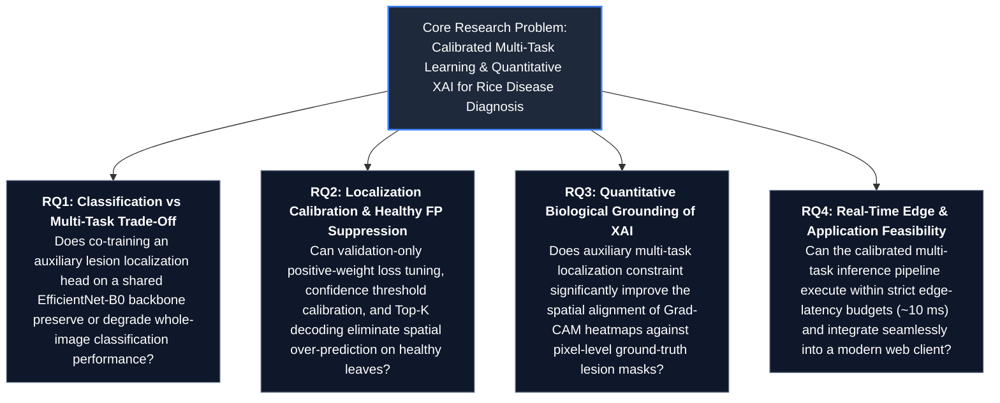

# Problem Statement and Project Title

## Project Title
**Multi-Task Deep Learning for Rice Leaf Disease Classification and Calibrated Lesion Localization with Explainable AI Grounding**

---

## Background of the Problem
Rice (*Oryza sativa*) serves as the primary caloric staple for over half of the global population, with smallholder farming systems in developing agrarian economies producing the vast majority of total harvest. However, foliar phytopathologies—principally bacterial blight, blast, brown spot, and tungro—routinely induce catastrophic crop yield losses ranging from 20% to over 70% under severe epidemic conditions. Traditional diagnostic practices depend heavily on visual inspection by agricultural extension officers or expert agronomists. In practical agricultural ecosystems, manual visual diagnosis suffers from fundamental bottlenecks:
1. **Severe Scarcity of Domain Experts**: Agronomists and plant pathologists are inaccessible to smallholder farmers operating in remote rural regions.
2. **Diagnostic Subjectivity & Symptom Overlap**: Early-stage necrotic spots, chlorotic streaking, and foliar lesions across different fungal and bacterial pathogens exhibit high visual and morphological ambiguity.
3. **Delayed Interventions**: Late or misidentified diagnoses lead either to catastrophic harvest collapse or the indiscriminate over-application of broad-spectrum chemical pesticides, resulting in environmental degradation and chemical resistance.

Recent advancements in computer vision and deep learning have catalyzed the development of automated image-based plant disease recognition tools. However, conventional automated systems are overwhelmingly formulated as whole-image classification tasks, creating a critical technological and operational divide when deployed in real-world agronomic contexts.

---

## Problem Statement
Standard Convolutional Neural Networks (CNNs) trained solely for image-level disease categorization suffer from three critical scientific and operational shortcomings:
1. **Absence of Spatial Evidence**: Whole-image classification outputs an abstract probability distribution across predefined disease classes without identifying where the pathological lesions exist on the leaf blade. Agricultural practitioners and field inspectors cannot verify whether the network decision was triggered by genuine pathogen-induced necrotic lesions or unrelated field artifacts (e.g., soil splatter, sunlight glints, weed foliage, background clutter).
2. **Localization Over-Prediction and Background Susceptibility**: Naive multi-task architectures that predict both disease category and spatial bounding boxes suffer from acute class imbalance between small foreground lesion areas and vast non-lesion/background regions. Uncalibrated multi-task models generate massive numbers of redundant, false-positive bounding boxes, over-predicting lesions even on completely healthy leaf tissue (yielding high healthy false-positive rates).
3. **Ungrounded and Faithless Post-Hoc Interpretability**: Saliency-based Explainable AI (XAI) algorithms, such as Gradient-weighted Class Activation Mapping (Grad-CAM), are frequently presented as qualitative heatmaps without rigorous quantitative spatial grounding against true biological lesion boundaries. Furthermore, classification-only backbones frequently exhibit high attention on image borders, leaf edges, and background artifacts rather than true pathological manifestations.

Therefore, there is an urgent need for an integrated, lightweight, multi-task deep learning framework that simultaneously classifies rice leaf diseases, generates spatially calibrated lesion bounding boxes with suppressed false alarms, and provides mathematically grounded visual explanations validated against independent pixel-level biological lesion masks.

---

## Motivation
1. **Food Security & Agronomic Decision Support**: Providing timely, accurate, and localized disease intelligence directly aids smallholder farmers in administering targeted, localized chemical treatments rather than broad-spectrum spraying, drastically lowering operational costs and pesticide runoff.
2. **Calibrated Spatial Localization**: Extending beyond pure classification to provide bounding-box localization without requiring heavyweight, compute-intensive two-stage object detectors (such as Faster R-CNN) allows the system to remain lightweight and edge-ready while offering spatial evidence.
3. **Scientific Accountability via XAI**: Transitioning Explainable AI from subjective visual cherry-picking into a rigorous, quantitative evaluation pipeline that validates whether multi-task learning actively steers deep network attention toward true biological lesions.

---

## Core Research Problem
> **How can a unified, lightweight convolutional architecture simultaneously achieve high disease classification accuracy and calibrated spatial lesion localization, while demonstrably suppressing background-induced false alarms and enhancing the biological grounding and faithfulness of visual attribution maps without increasing computational overhead?**

---

## Research Questions

- **RQ1 (Architectural Compatibility)**: What is the empirical impact on disease classification accuracy and macro F1 when a single EfficientNet-B0 backbone is bifurcated into simultaneous classification and spatial grid regression heads compared to a dedicated classification-only baseline?
- **RQ2 (Spatial Calibration & False-Positive Control)**: How effectively can targeted positive-weight optimization ($w_{\text{pos}}$), empirical confidence threshold calibration ($\tau$), and Top-$K$ candidate decoding suppress background hallucination and reduce false-positive box generation on healthy leaf samples?
- **RQ3 (Biological Grounding & Faithfulness)**: To what extent does multi-task localization regularize intermediate feature representations, and does it yield statistically significant improvements in spatial grounding (Energy-Inside-Mask, Attribution IoU, Pointing Game) and perturbation faithfulness (Insertion/Deletion AUC) evaluated across independent biological segmentation masks?
- **RQ4 (Operational Latency & Web Integration)**: Can the complete calibrated multi-task inference pipeline maintain low computational latency ($\le 15$ ms per image) suitable for edge deployment while supporting dual-output visual rendering in a modular client-server application architecture?

---

## Project Objectives

### Primary Objective
To design, implement, rigorously evaluate, and integrate **RiceGuard**—a lightweight, multi-task deep learning framework built on a shared EfficientNet-B0 backbone that delivers accurate 6-class rice leaf disease diagnosis, calibrated spatial lesion bounding boxes, and quantitatively validated Explainable AI grounding, deployable across client-server environments.

### Specific Objectives
1. **Dataset Pipeline & Scientific Governance**: Assemble, standardize, and partition a robust 6-class field-collected dataset ($N = 3,355$ images across Bacterial Blight, Blast, Brown Spot, Tungro, Healthy, and Leaf Scald) using strict patient-level split governance, while curating an independent pixel-level dataset (RiceSeg5932, $N = 4,348$ masks) reserved strictly for zero-shot post-hoc XAI evaluation.
2. **Classification Baseline Engineering**: Develop, train, and benchmark a high-performance classification-only baseline (Phase 2B) utilizing an EfficientNet-B0 backbone with cosine annealing learning rate schedules, establishing benchmark classification accuracy and Macro F1.
3. **Multi-Task Network Bifurcation**: Design and implement a multi-task network (Phase 3) that bifurcates the terminal $1280 \times 7 \times 7$ feature representation into:
   - A global classification head yielding class logits $\hat{\mathbf{y}} \in \mathbb{R}^6$.
   - A dense $7 \times 7$ spatial localization head predicting grid-level objectness and bounding-box coordinates $(l_{\text{obj}}, dx, dy, w, h)$.
4. **Phase 3B Localization Calibration & Decoding**: Formulate a positive-weight binary cross-entropy loss ($w_{\text{pos}} = 10.0$) and systematically execute a validation-only grid sweep across confidence thresholds $\tau \in [0.10, 0.90]$ and Top-$K \in [1, 10]$ to minimize healthy false-positive rates and eliminate dense box clutter.
5. **Quantitative XAI Grounding & Faithfulness Evaluation**: Implement a layer-targeted Grad-CAM attribution pipeline and benchmark spatial grounding metrics (Energy-Inside-Mask, Attribution IoU, Pointing Game Accuracy, Healthy Leaf Border Attention) and perturbation faithfulness curves (Insertion/Deletion AUC) across $N = 4,348$ independent biological lesion masks.
6. **Statistical Rigor & Significance Testing**: Perform McNemar's tests, paired $t$-tests, and Wilcoxon signed-rank tests across test splits to scientifically validate differences between classification-only and multi-task models.
7. **End-to-End Application Integration & Deployment Preparation**: Develop a high-throughput asynchronous backend service (FastAPI) and a modern, responsive web interface (React 19 / Vite 6) capable of receiving leaf image uploads, executing real-time inference, and rendering dual-pane diagnosis with calibrated spatial overlays.
