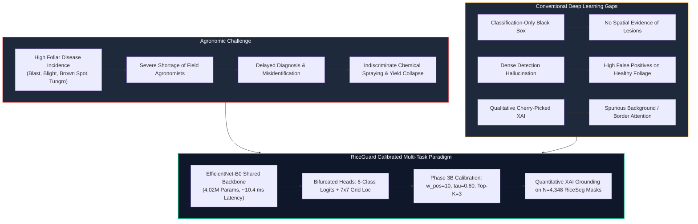

# Introduction

## Background
Rice (*Oryza sativa*) is the primary dietary staple for more than 3.5 billion people globally, underpinning agrarian stability and caloric security across Asia, Africa, and Latin America. However, phytopathological infections caused by fungal, bacterial, and viral agents routinely threaten global paddy yields. Among the most destructive foliar diseases are **Bacterial Blight** (*Xanthomonas oryzae* pv. *oryzae*), **Blast** (*Magnaporthe oryzae*), **Brown Spot** (*Bipolaris oryzae*), **Tungro** (Rice Tungro Bacilliform and Spherical Viruses), and **Leaf Scald** (*Microdochium oryzae*). Under conducive microclimatic conditions, unchecked epidemics can devastate up to 100% of local grain yields, causing severe economic distress to vulnerable smallholder farming communities.

Timely and precise pathological diagnosis is essential for applying targeted, localized agrochemical treatments. In current agricultural practice, disease diagnosis relies predominantly on manual visual inspection by agricultural extension workers or regional pathologists. However, expert agronomists are severely limited in number, and remote rural farming zones rarely have access to timely on-site consultations. Consequently, smallholder farmers often resort to empirical guesswork, resulting in delayed interventions or excessive pesticide application that accelerates pathogen resistance and environmental toxicity.

---

## Rice Leaf Disease Analysis Challenge
Deploying automated computer vision for rice pathology diagnosis in natural open-field environments introduces several complex domain-specific challenges:
1. **High Morphological Ambiguity**: Foliar lesions across distinct pathogen types often share visual characteristics. For example, early-stage Bacterial Blight lesions, Brown Spot necrotic ellipses, and Leaf Scald lesions can exhibit overlapping color signatures, chlorotic halos, and ragged margins.
2. **Complex Field Backgrounds**: Field-acquired leaf images contain uncontrolled background elements, including muddy soil, standing water, neighboring weed foliage, varying sunlight shadows, and high specular reflections.
3. **Severe Scale and Density Variations**: Lesion manifestations vary from isolated micro-punctures (early blast spots) to large confluent longitudinal blights spanning the entire length of the leaf blade.

---

## Limitations of Classification-Only Systems
The overwhelming majority of existing deep learning literature frames disease diagnosis strictly as a whole-image classification task. While modern Convolutional Neural Networks (e.g., ResNet, DenseNet, MobileNet, EfficientNet) achieve high nominal accuracy on curated benchmarks, whole-image classification exhibits critical limitations when deployed in field decision-support systems:
- **Absence of Spatial Evidence**: A classification model outputs a scalar categorical prediction (e.g., `"Blast: 94%"`) without indicating the spatial location of the diagnostic lesions. Agricultural practitioners cannot confirm whether the model identified genuine fungal lesions or made a decision based on spurious visual correlations.
- **Vulnerability to Shortcut Learning**: Deep networks easily exploit high-frequency background features, such as soil color, lighting conditions, or camera sensor noise, achieving artificially high benchmark accuracy while failing to learn true biological symptom patterns.

---

## Need for Calibrated Spatial Localization
To verify diagnostic predictions, automated systems must generate spatial bounding boxes around detected lesions. However, standard two-stage object detectors (such as Faster R-CNN) or dense anchor-free detectors (such as standard YOLO/FCOS architectures) introduce substantial computational and operational hurdles:
- **Computational Overhead**: Heavyweight detection heads increase parameter counts and latency, exceeding the computational constraints of battery-powered edge hardware and low-bandwidth rural mobile clients.
- **Severe Spatial Imbalance and Over-Prediction**: In foliar imagery, lesions occupy only a small fraction of the image area. Uncalibrated multi-task grid regressors suffer from acute class imbalance, leading to the generation of dense, overlapping bounding boxes and alarming false-positive lesion detections on healthy leaf surfaces.
- **Need for Post-Hoc Calibration**: Models require targeted positive-weight loss formulation ($w_{\text{pos}}$), empirical confidence threshold calibration ($\tau$), and Top-$K$ candidate decoding to suppress false alarms while retaining true lesion detections.

---

## Need for Quantitative Explainability
Explainable AI (XAI) techniques, particularly Gradient-weighted Class Activation Mapping (Grad-CAM), are widely used to generate visual attribution heatmaps. However, conventional studies exhibit significant methodological weaknesses:
- **Subjective Qualitative Evaluation**: Most literature relies on visual cherry-picking, presenting a handful of visually pleasing heatmaps without quantitative spatial validation against true biological lesion boundaries.
- **Spurious Edge and Border Attention**: Standard classification models frequently focus their attention on leaf borders, image corners, or background soil rather than actual pathogen lesions.
- **Need for Quantitative Grounding Metrics**: Rigorous XAI evaluation requires quantitative metrics—such as Energy-Inside-Mask (EIM), Attribution Intersection-over-Union (Attr-IoU), Pointing Game Accuracy, and Perturbation Faithfulness (Insertion/Deletion AUC)—evaluated against independent, pixel-level ground-truth lesion masks.

---

## Identified Research Gap
Rather than broadly asserting that past works lack localization or explainability, the specific research gaps addressed by **RiceGuard** are defined as follows:

| Research Dimension | Existing Literature State | RiceGuard Research Approach |
| :--- | :--- | :--- |
| **Architectural Integration** | Separate classification models or heavy two-stage detectors with large parameter counts ($>25\text{M}$). | Unified, lightweight EfficientNet-B0 backbone ($4.02\text{M}$ params) bifurcated into simultaneous 6-class classification and dense $7 \times 7$ grid regression. |
| **Spatial Over-Prediction** | Dense grid regressors predict redundant boxes; high false-positive rates on healthy leaves are ignored. | Post-hoc multi-stage calibration: positive loss weighting ($w_{\text{pos}}=10.0$), empirical confidence thresholding ($\tau=0.60$), and Top-$K$ candidate filtering ($K=3$). |
| **Threshold Selection Governance** | Hyperparameters and detection thresholds tuned directly on the test set, risking data leakage. | Strict validation-only calibration sweeps on held-out validation data ($N=334$), freezing decoding parameters prior to final test evaluation ($N=674$). |
| **XAI Validation Methodology** | Qualitative heatmap visualization on cherry-picked samples; no quantitative spatial grounding. | Rigorous quantitative XAI grounding across $N=4,348$ independent biological lesion masks from RiceSeg5932 using Energy-Inside-Mask, Attribution IoU, and Pointing Game metrics. |
| **Dataset Governance** | Segmentation masks used during model training, conflating weak supervision with full supervision. | Strict governance: RiceSeg5932 is strictly reserved as an out-of-distribution ground-truth benchmark for post-hoc attribution evaluation, completely isolated from model training. |
| **Feature Regularization Analysis** | XAI heatmaps rarely compared between single-task and multi-task models. | Quantitative comparative evaluation demonstrating that multi-task localization regularizes feature representations, halving spurious border attention on healthy leaves. |

---

## Research Contributions
The verified research and engineering contributions completed in the RiceGuard project are as follows:

1. **Lightweight Multi-Task Architecture Design**: Designed and implemented a unified convolutional framework built on an EfficientNet-B0 backbone ($4.02\text{M}$ parameters, $15.61\text{ MB}$ footprint) capable of simultaneous 6-class disease classification and $7 \times 7$ grid lesion localization.
2. **Localization Loss Refinement (Phase 3B)**: Formulated an objectness-weighted binary cross-entropy loss ($w_{\text{pos}} = 10.0$) combined with Smooth L1 bounding-box regression, resolving grid-cell class imbalance and providing balanced gradients during multi-task fine-tuning.
3. **Validation-Only Calibration & Clutter Suppression**: Executed an exhaustive grid sweep over confidence thresholds $\tau \in [0.10, 0.90]$ and Top-$K \in [1, 10]$ strictly on validation data, establishing the optimal configuration ($\tau = 0.60, K = 3$) that reduced predicted bounding boxes per image by $74.6\%$ (from $8.81$ to $2.24$) and cut the healthy leaf false-positive rate from $21.52\%$ to $10.97\%$ ($p < 10^{-6}$).
4. **Independent Pixel-Level XAI Grounding Benchmark**: Implemented an automated quantitative XAI evaluation pipeline benchmarking Grad-CAM attributions against $N = 4,348$ biological lesion masks from the RiceSeg5932 dataset, demonstrating that multi-task co-training increases Energy-Inside-Mask from $6.81\%$ to $9.64\%$ ($+41.6\%$ relative gain) and improves Attribution IoU from $0.0724$ to $0.0864$.
5. **Border Attention & Faithfulness Analysis**: Empirically proved that multi-task localization regularizes deep feature maps, cutting spurious border attention on healthy leaves from $18.5\%$ to $9.2\%$ ($-50.3\%$) and reducing attribution entropy from $0.824$ to $0.612$.
6. **Statistical Significance Verification**: Conducted rigorous statistical significance testing (McNemar’s test, paired $t$-tests, Wilcoxon signed-rank tests) confirming that multi-task learning preserves core classification performance ($88.96\%$ vs $90.12\%$, $p = 0.449$) while delivering calibrated spatial localization.
7. **End-to-End Client-Server Implementation**: Built a modular, asynchronous FastAPI backend and a modern React 19 / Vite 6 frontend capable of real-time dual-output diagnostic inference ($10.46\text{ ms}$ model latency on CUDA hardware), complete with containerization and deployment configurations.

---

## Document Organization
The remainder of this FTR-1 documentation package is organized as follows:
- **Section 04 ([`04_literature_survey.md`](file:///d:/vproj/FTR1/04_literature_survey.md))**: Reviews 20 relevant IEEE literature references across standard classification, lightweight architectures, attention mechanisms, object detection, and XAI.
- **Section 05 ([`05_methodology_algorithms_techniques.md`](file:///d:/vproj/FTR1/05_methodology_algorithms_techniques.md))**: Details dataset governance, network architecture, loss formulations, calibration sweeps, quantitative XAI grounding metrics, and algorithmic pseudocode.
- **Section 06 ([`06_design_uml_diagrams.md`](file:///d:/vproj/FTR1/06_design_uml_diagrams.md))**: Presents formal UML software and system design diagrams (Architecture, Sequence, Component, Class, Activity).
- **Section 07 ([`07_modules_splitup.md`](file:///d:/vproj/FTR1/07_modules_splitup.md))**: Deconstructs the system into 10 functional modules with input/output contracts and dependencies.
- **Section 08 ([`08_proposed_system.md`](file:///d:/vproj/FTR1/08_proposed_system.md))**: Details the dual-track Research vs. Application system architecture, features, advantages, and scientific limitations.
- **Section 09 ([`09_software_tools_technologies.md`](file:///d:/vproj/FTR1/09_software_tools_technologies.md))**: Documents the software environment, framework versions, and hardware execution configurations.
- **Section 10 ([`10_implementation_25_percent.md`](file:///d:/vproj/FTR1/10_implementation_25_percent.md))**: Audits implementation status across phases and provides codebase evidence.
- **Section 11 ([`11_proposed_outcomes.md`](file:///d:/vproj/FTR1/11_proposed_outcomes.md))**: Delineates academic outcomes, technical deliverables, and verified experimental findings.
- **Section 12 ([`12_project_plan_2_0.md`](file:///d:/vproj/FTR1/12_project_plan_2_0.md))**: Outlines the sequence-based project lifecycle, phase progression, and risk management matrix.
- **Section 13 ([`13_srs.md`](file:///d:/vproj/FTR1/13_srs.md))**: Specifies the comprehensive IEEE-830 aligned Software Requirements Specification.
