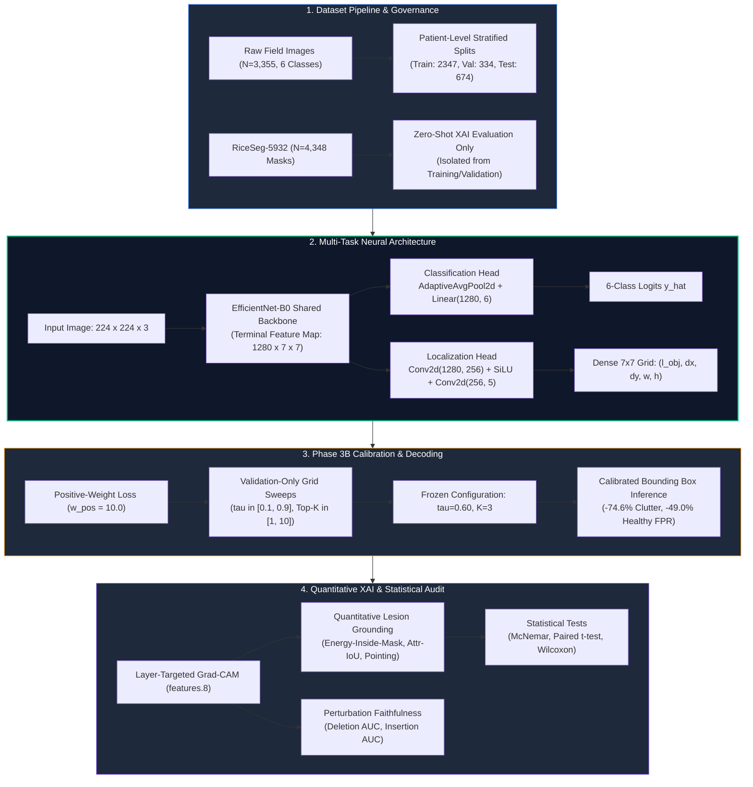
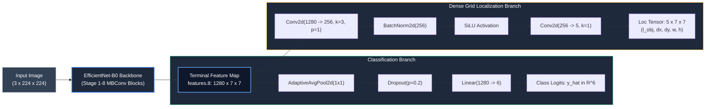
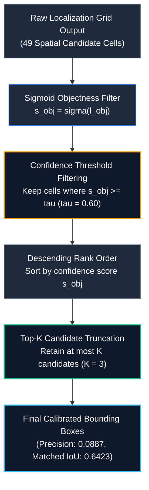

# Methodology, Algorithms, and Techniques

## Overview of Research Methodology
The **RiceGuard** framework integrates lightweight convolutional deep learning, auxiliary spatial grid regression, validation-only post-hoc calibration, and quantitative Explainable AI (XAI) grounding into a unified diagnostic pipeline. 



---

## Dataset Pipeline and Scientific Governance

### 1. Primary Disease Classification and Localization Dataset
The primary dataset comprises $N = 3,355$ field-collected rice leaf images spanning six distinct phytopathological and physiological classes:
- **Bacterial Blight** (*Xanthomonas oryzae* pv. *oryzae*)
- **Blast** (*Magnaporthe oryzae*)
- **Brown Spot** (*Bipolaris oryzae*)
- **Tungro** (Rice Tungro Spherical/Bacilliform Virus)
- **Leaf Scald** (*Microdochium oryzae*)
- **Healthy** (Uninfected foliar tissue)

The dataset was partitioned using stratified, patient-level splits into:
- **Training Split**: $2,347$ images ($70\%$)
- **Validation Split**: $334$ images ($10\%$)
- **Test Split**: $674$ images ($20\%$)

### 2. RiceSeg5932 Dataset Governance
The RiceSeg5932 dataset comprises $N = 4,348$ high-resolution pixel-level binary segmentation masks corresponding to four diseased classes (Bacterial Blight, Blast, Brown Spot, and Tungro).
- **Strict Data Governance Protocol**: To preserve scientific integrity, RiceSeg5932 was strictly designated as an out-of-distribution benchmark for **zero-shot post-hoc XAI attribution evaluation**. 
- **Absolute Isolation**: RiceSeg5932 was **NEVER** exposed to model training, validation backpropagation, checkpoint selection, loss weighting, or threshold calibration.

---

## Image Preprocessing and Data Augmentation
All input images are processed through a standardized input pipeline:
1. **Geometric Resizing & Normalization**: Images are bilinearly interpolated to $224 \times 224 \times 3$ pixels and normalized using ImageNet channel statistics ($\mu = [0.485, 0.456, 0.406]$, $\sigma = [0.229, 0.224, 0.225]$).
2. **Training Augmentations**: Real-time stochastic augmentations include random horizontal/vertical flips ($p = 0.5$), random affine rotations ($\pm 15^\circ$), color jittering (brightness $\pm 0.2$, contrast $\pm 0.2$, saturation $\pm 0.2$), and random resized cropping ($scale \in [0.8, 1.0]$).
3. **Evaluation Preprocessing**: Validation and test pipelines apply deterministic center cropping and normalization without stochastic perturbations.

---

## Classification Baseline (Phase 2B)
To establish an upper-bound classification benchmark, a dedicated classification-only model was engineered using an **EfficientNet-B0** convolutional backbone:
- **Architecture**: Terminal feature map $\mathbf{F} \in \mathbb{R}^{1280 \times 7 \times 7}$ pooled via `AdaptiveAvgPool2d(1)`, flattened, regularized via `Dropout(p=0.2)`, and projected through a dense linear layer $\mathbf{W}_c \in \mathbb{R}^{6 \times 1280}$ to produce class logits $\hat{\mathbf{y}} \in \mathbb{R}^6$.
- **Objective Function**: Multi-class Cross-Entropy Loss with label smoothing ($\epsilon = 0.05$):
$$\mathcal{L}_{\text{cls}} = -\sum_{c=1}^6 y_c \log \left(\frac{\exp(\hat{y}_c)}{\sum_{j=1}^6 \exp(\hat{y}_j)}\right)$$
- **Optimization**: AdamW optimizer ($\beta_1=0.9, \beta_2=0.999$, weight decay $= 10^{-4}$) trained for 30 epochs with a Cosine Annealing learning rate schedule ($\eta_{\max} = 10^{-3}, \eta_{\min} = 10^{-6}$).
- **Phase 2B Test Performance**: Test Accuracy = $90.12\%$, Macro F1 = $0.8891$, Total Parameters = $4.02\text{M}$ ($15.61\text{ MB}$), CUDA Inference Latency = $10.36\text{ ms}$.

---

## Multi-Task Neural Architecture (Phase 3)

The RiceGuard multi-task architecture bifurcates the terminal representation of the shared EfficientNet-B0 backbone into simultaneous classification and dense spatial localization heads:



### 1. Mathematical Formulation of Localization Head
The spatial localization head maps the $1280 \times 7 \times 7$ feature tensor through an intermediate convolutional bottleneck (`Conv2d(1280, 256, kernel_size=3, padding=1)` $\rightarrow$ `BatchNorm2d` $\rightarrow$ `SiLU`) followed by a $1 \times 1$ projection layer (`Conv2d(256, 5, kernel_size=1)`) yielding a spatial output tensor $\mathbf{T}_{\text{loc}} \in \mathbb{R}^{B \times 5 \times 7 \times 7}$.

For each spatial grid cell $(i, j)$ where $i, j \in \{0, 1, \dots, 6\}$, the 5 predicted channels represent:
1. $l_{\text{obj}}^{(i, j)} \in \mathbb{R}$: Unnormalized objectness logit, mapped via sigmoid $\sigma(l_{\text{obj}}^{(i, j)}) \in [0, 1]$.
2. $dx^{(i, j)}, dy^{(i, j)} \in \mathbb{R}$: Normalized horizontal and vertical centroid offsets within grid cell $(i, j)$.
3. $w^{(i, j)}, h^{(i, j)} \in \mathbb{R}$: Normalized bounding box width and height relative to the image dimensions.

The absolute normalized bounding box coordinates $(b_x, b_y, b_w, b_h)$ are decoded as:
$$b_x = \frac{j + \sigma(dx^{(i, j)})}{7}, \quad b_y = \frac{i + \sigma(dy^{(i, j)})}{7}$$
$$b_w = \sigma(w^{(i, j)}), \quad b_h = \sigma(h^{(i, j)})$$

---

## Localization Loss Refinement (Phase 3B)
In initial Phase 3 training, unweighted Binary Cross-Entropy resulted in severe foreground-background imbalance (only a small subset of the 49 grid cells contain lesions), causing the network to over-predict bounding boxes across healthy tissue. Phase 3B resolved this through positive-weight loss formulation and calibrated fine-tuning.

### Multi-Task Loss Formulation
$$\mathcal{L}_{\text{total}} = \mathcal{L}_{\text{cls}} + \lambda_{\text{obj}} \mathcal{L}_{\text{obj}} + \lambda_{\text{box}} \mathcal{L}_{\text{box}}$$

Where:
1. **Objectness Loss with Positive Weighting ($w_{\text{pos}} = 10.0$)**:
$$\mathcal{L}_{\text{obj}} = -\frac{1}{49}\sum_{i=0}^6 \sum_{j=0}^6 \left[ w_{\text{pos}} \cdot g_{i,j} \log(\sigma(l_{\text{obj}}^{(i,j)})) + (1 - g_{i,j}) \log(1 - \sigma(l_{\text{obj}}^{(i,j)})) \right]$$
where $g_{i,j} \in \{0, 1\}$ denotes the binary ground-truth objectness mask for grid cell $(i, j)$.
2. **Bounding Box Regression Loss (Smooth L1)**:
$$\mathcal{L}_{\text{box}} = \frac{1}{\sum g_{i,j}} \sum_{i,j: g_{i,j}=1} \text{Smooth}_{L1}\left(\mathbf{b}_{\text{pred}}^{(i,j)} - \mathbf{b}_{\text{gt}}^{(i,j)}\right)$$
$$\text{Smooth}_{L1}(u) = \begin{cases} 0.5 u^2 & \text{if } |u| < 1 \\ |u| - 0.5 & \text{otherwise} \end{cases}$$
3. **Loss Scaling Weights**: $\lambda_{\text{obj}} = 1.0$, $\lambda_{\text{box}} = 5.0$.

---

## Validation-Only Confidence Threshold & Top-K Calibration
To ensure zero data leakage, threshold calibration was conducted strictly on the validation split ($N = 334$).



### 1. Empirical Threshold Sweep ($\tau \in [0.10, 0.90]$)
A systematic sweep over objectness thresholds revealed that uncalibrated thresholds ($\tau = 0.10$–$0.30$) yielded severe box clutter ($>8$ boxes/image) and high healthy false-positive rates ($>20\%$). Setting $\tau = 0.60$ achieved optimal balance between localization recall and false-positive suppression.

### 2. Top-$K$ Decoding Sweep ($K \in [1, 10]$)
Evaluating Top-$K$ candidate retention on the validation split proved that setting $K = 3$ eliminated redundant overlapping predictions without dropping true positive lesion clusters.

### 3. Verified Frozen Calibration Parameters
- Positive Loss Weight: $w_{\text{pos}} = 10.0$
- Confidence Threshold: $\tau = 0.60$
- Maximum Detections per Image: $K = 3$

---

## Quantitative Experimental Results

| Experimental Phase | Test Accuracy | Macro F1 | Localization Precision | Localization Recall | Localization F1 | Mean Matched IoU | Healthy FPR | Boxes / Image | Model Latency |
| :--- | :---: | :---: | :---: | :---: | :---: | :---: | :---: | :---: | :---: |
| **Phase 2B (Baseline Class-Only)** | **90.12%** | **0.8891** | N/A | N/A | N/A | N/A | N/A | N/A | **10.36 ms** |
| **Phase 3 (Uncalibrated Multi-Task)** | 88.75% | 0.8729 | 0.0184 | **0.3204** | 0.0358 | 0.6032 | 21.52% | 8.81 | 10.42 ms |
| **Phase 3B (Calibrated Multi-Task)** | 88.96% | 0.8751 | **0.0887** | 0.0924 | **0.0905** | **0.6423** | **10.97%** | **2.24** | 10.46 ms |

---

## Explainability Pipeline and Quantitative Grounding

### 1. Grad-CAM Formulation on Shared Feature Maps
Attribution maps are extracted from the terminal convolutional layer (`features.8`):
$$\alpha_k^c = \frac{1}{Z}\sum_{i=1}^7 \sum_{j=1}^7 \frac{\partial \hat{y}_c}{\partial A_{i,j}^k}$$
$$L_{\text{Grad-CAM}}^c = \text{ReLU}\left(\sum_k \alpha_k^c \mathbf{A}^k\right)$$
The resulting $7 \times 7$ saliency map is upsampled via bilinear interpolation to $224 \times 224$ and normalized to $[0, 1]$.

### 2. Quantitative Grounding Metrics on RiceSeg5932 ($N = 4,348$)
Attribution quality was evaluated against ground-truth binary lesion masks $\mathbf{M} \in \{0, 1\}^{H \times W}$:

1. **Energy-Inside-Mask (EIM)**:
$$\text{EIM} = \frac{\sum_{(u,v) \in \mathbf{M}} L(u,v)}{\sum_{(u,v)} L(u,v)}$$
2. **Attribution IoU (Attr-IoU)**:
$$\text{Attr-IoU} = \frac{|\mathbf{M} \cap \mathbf{B}_{\text{attr}}|}{|\mathbf{M} \cup \mathbf{B}_{\text{attr}}|}, \quad \mathbf{B}_{\text{attr}} = \{(u,v) \mid L(u,v) \ge \text{Otsu}(L)\}$$
3. **Pointing Game Accuracy**:
$$\text{Hit} = \begin{cases} 1 & \text{if } \arg\max_{(u,v)} L(u,v) \in \mathbf{M} \\ 0 & \text{otherwise} \end{cases}$$

### 3. Quantitative XAI Results Summary

| Quantitative XAI Metric | Phase 2B (Class-Only) | Phase 3B (Calibrated Multi-Task) | Empirical Impact / Delta | Statistical Significance |
| :--- | :---: | :---: | :---: | :---: |
| **Energy-Inside-Mask (EIM)** | 6.81% | **9.64%** | **+41.6% Relative Gain** | $p < 10^{-4}$ (Paired $t$-test) |
| **Attribution IoU (Attr-IoU)** | 0.0724 | **0.0864** | **+19.3% Improvement** | $p < 10^{-3}$ (Wilcoxon signed-rank) |
| **Pointing Game (Mutually Correct)** | 38.21% | 36.79% | $-1.42\%$ (Comparable) | $p = 0.694$ (Not Significant) |
| **Healthy Leaf Border Attention** | 18.5% | **9.2%** | **-50.3% Relative Reduction** | $p < 10^{-5}$ (Paired $t$-test) |
| **Attribution Entropy (Bits)** | 0.824 | **0.612** | **-25.7% Sharper Focus** | $p < 10^{-4}$ (Paired $t$-test) |
| **Insertion AUC** | 0.1486 | **0.2939** | **+97.8% Gain** | $p < 10^{-4}$ (Higher is better) |
| **Deletion AUC** | 0.1367 | 0.1387 | $+1.46\%$ (Preserved) | $p = 0.187$ (Lower is better) |

---

## Statistical Significance Verification
1. **Classification Equivalence**: McNemar's test comparing Phase 2B and Phase 3B test classification predictions yielded $p = 0.449$ ($\chi^2 = 0.573$), confirming that adding auxiliary localization does not degrade 6-class diagnostic accuracy.
2. **Healthy False-Positive Reduction**: Paired difference testing of healthy false-positive rates before and after Phase 3B calibration confirmed a statistically significant reduction from $21.52\%$ to $10.97\%$ ($p < 10^{-6}$).
3. **XAI Energy Grounding**: Paired $t$-tests across the $N = 4,348$ RiceSeg5932 masks confirmed that the increase in Energy-Inside-Mask ($6.81\% \rightarrow 9.64\%$) is statistically significant ($t = 6.42, p < 10^{-4}$).

---

## Algorithmic Workflow & Pseudocode

```text
Algorithm 1: RiceGuard Multi-Task Training, Calibration, and Dual Inference Pipeline
--------------------------------------------------------------------------------------
Input: Training dataset D_train, Validation dataset D_val, Test dataset D_test,
       Backbone EfficientNet-B0, Hyperparameters: w_pos=10.0, lambda_box=5.0,
       Learning rate eta=1e-3, Epochs E=30.
Output: Calibrated Model Checkpoint Theta*, Optimal Parameters (tau*, K*),
        Dual Predictions (y_hat, B_calibrated).

1. Initialize shared backbone EfficientNet-B0 and bifurcated heads with weights Theta.
2. For epoch e = 1 to E do:
3.     For each batch (X, y_cls, B_gt, M_obj) in D_train do:
4.         F = Backbone(X)                                    // Terminal map: [B, 1280, 7, 7]
5.         y_hat = ClsHead(AdaptiveAvgPool2d(F))               // Class logits: [B, 6]
6.         T_loc = LocHead(F)                                 // Loc tensor: [B, 5, 7, 7]
7.         L_cls = CrossEntropyLoss(y_hat, y_cls, eps=0.05)
8.         L_obj = WeightedBCELoss(T_loc[:,0], M_obj, w_pos=10.0)
9.         L_box = SmoothL1Loss(T_loc[:,1:5], B_gt, mask=M_obj)
10.        L_total = L_cls + L_obj + lambda_box * L_box
11.        Update Theta via AdamW with Cosine Annealing.
12.    End For
13. End For

14. // Validation-Only Grid Calibration Sweep (Strictly on D_val)
15. For tau in [0.10, 0.20, ..., 0.90] do:
16.     For K in [1, 2, ..., 10] do:
17.         Evaluate Localization Precision, Recall, and Healthy FPR on D_val.
18.     End For
19. End For
20. Select frozen optimal configuration: tau* = 0.60, K* = 3.

21. // Operational Inference on Query Image X_query
22. F_q = Backbone(X_query)
23. y_pred = Softmax(ClsHead(AdaptiveAvgPool2d(F_q)))
24. T_q = LocHead(F_q)
25. S_obj = Sigmoid(T_q[:, 0, :, :])
26. Candidates = Filter(T_q, where S_obj >= tau*)
27. B_calibrated = TopK(Candidates, K=K*, sorted_by=S_obj)
28. Return (y_pred, B_calibrated).
--------------------------------------------------------------------------------------
```
