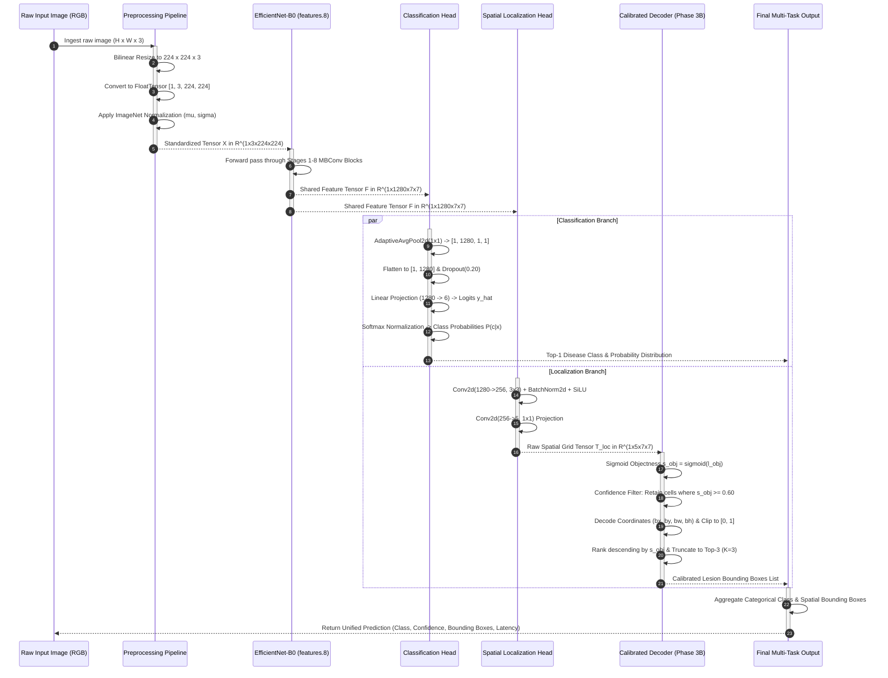

# Deep Learning Inference Sequence

## Overview
This document models the internal execution lifecycle of the **RiceGuard Deep Learning Inference Pipeline**. It details the synchronous tensor transformations occurring within the neural network and decoding modules during a single forward evaluation pass, excluding external network or web application layers.

---

## Inference Sequence Diagram

---

## Detailed Step-by-Step Execution Lifecycle

1. **Image Ingestion**: The inference engine receives an RGB image tensor.
2. **Preprocessing**: The raw image is resized to $224 \times 224$ via bilinear interpolation, converted to a PyTorch tensor, and normalized using channel means $\boldsymbol{\mu} = [0.485, 0.456, 0.406]$ and standard deviations $\boldsymbol{\sigma} = [0.229, 0.224, 0.225]$.
3. **Shared Feature Extraction**: The input tensor passes through Stages 1–8 of the EfficientNet-B0 backbone, producing the shared spatial feature map $\mathbf{F} \in \mathbb{R}^{1 \times 1280 \times 7 \times 7}$ at `features.8`.
4. **Parallel Prediction Streams**:
   - **Classification Stream**: $\mathbf{F}$ is spatially pooled (`AdaptiveAvgPool2d(1)`), flattened, regularized (`Dropout(0.20)`), projected via a linear classifier (`Linear(1280, 6)`), and normalized via softmax to generate 6-class posterior probabilities.
   - **Localization Stream**: $\mathbf{F}$ passes through a convolutional bottleneck (`Conv2d(1280, 256, 3, pad=1)` $\rightarrow$ `BatchNorm2d` $\rightarrow$ `SiLU` $\rightarrow$ `Conv2d(256, 5, 1)`) yielding a spatial grid tensor $\mathbf{T}_{\text{loc}} \in \mathbb{R}^{1 \times 5 \times 7 \times 7}$.
5. **Calibrated Box Decoding**:
   - Objectness logits and spatial offsets are mapped via sigmoid functions.
   - Grid cells with objectness scores $s_{\text{obj}} < 0.60$ are filtered out.
   - Centroid coordinates and dimensions are decoded, normalized relative to grid cell indices, and clipped to the interval $[0.0, 1.0]$.
   - Remaining candidates are sorted descending by confidence and truncated to the Top-$3$ most salient detections.
6. **Output Assembly**: The diagnostic class prediction, confidence percentage, probability distribution, calibrated bounding boxes, and model forward execution latency ($10.46\text{ ms}$) are aggregated into a unified output payload.
