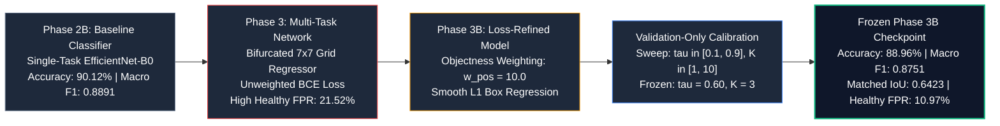

# System Architecture and Design

## 1. Overview
**RiceGuard** is a specialized, multi-task deep learning framework engineered for simultaneous foliar disease classification and calibrated spatial lesion localization on rice (*Oryza sativa*) leaves. Built upon a shared, lightweight **EfficientNet-B0** convolutional backbone ($4.02\text{M}$ parameters, $15.61\text{ MB}$ memory footprint), the network bifurcates intermediate representations to simultaneously output categorical class probabilities and spatial bounding-box regression coordinates. 

The production-frozen model corresponds to the **Phase 3B Refined Architecture**, which integrates positive-weight loss optimization ($w_{\text{pos}} = 10.0$) and a validation-only empirical calibration pipeline ($\tau = 0.60, K = 3$) to eliminate spatial over-prediction on healthy leaf foliage while maintaining real-time inference latency ($10.46\text{ ms}$ on CUDA hardware).

---

## 2. Overall Deep Learning Architecture
The operational deep learning inference pipeline progresses through the following sequential stages:

```text
Raw Rice Leaf Image (RGB)
        ↓
Inference Preprocessing (Resize 224x224, ImageNet Normalization)
        ↓
EfficientNet-B0 Convolutional Backbone (Stages 1–8 MBConv)
        ↓
Shared Feature Representation (features.8: 1280 x 7 x 7)
        ├─────────────────────────────────────────┐
        ↓                                         ↓
Classification Branch                     Localization Branch
[AdaptiveAvgPool2d(1) ->                  [Conv2d(1280->256, 3x3) ->
 Dropout(0.2) -> Linear(1280->6)]          BatchNorm2d -> SiLU ->
        ↓                                  Conv2d(256->5, 1x1)]
Raw 6-Class Logits                                ↓
        ↓                                 Raw Grid Tensor [5, 7, 7]
Softmax Posterior Probabilities                   ↓
        ↓                                 Calibrated Box Decoding
Predicted Disease Class + Confidence      (Sigmoid, tau=0.60, Top-K=3, Clip)
        │                                         ↓
        │                                 Filtered Lesion Bounding Boxes
        └───────────────────┬─────────────────────┘
                            ↓
             Final Multi-Task Prediction
   (Disease Classification + Calibrated Spatial Overlays)
```

---

## 3. System Architecture Diagram

```mermaid
flowchart TB
    %% Data Governance Subgraph
    subgraph Data_Governance["Dataset Governance & Partitioning Protocol"]
        direction TB
        DG_Primary["Primary Field Dataset<br/>(N = 3,355 Images, 6 Classes)"] --> DG_Splits["Stratified Patient-Level Splits<br/>Train: 2,347 (70%) | Val: 334 (10%) | Test: 674 (20%)"]
        DG_RiceSeg["RiceSeg5932 Benchmark<br/>(N = 4,348 Pixel-Level Lesion Masks)"] --> DG_Isolated["Strict XAI Ground-Truth Isolation<br/>(Zero Exposure to Training / Validation / Tuning)"]
    end

    %% Input and Preprocessing Subgraph
    subgraph Input_Preprocessing["1. Input Ingestion & Preprocessing Pipeline"]
        direction TB
        IN_Raw["Raw Rice Leaf Image<br/>(Format: JPEG/PNG/WEBP, RGB)"] --> PP_Resize["Bilinear Interpolation<br/>Target Resolution: 224 x 224 x 3"]
        PP_Resize --> PP_Tensor["Tensor Conversion<br/>torch.FloatTensor: [B, 3, 224, 224]"]
        PP_Tensor --> PP_Norm["Channel Normalization<br/>mu = [0.485, 0.456, 0.406]<br/>sigma = [0.229, 0.224, 0.225]"]
    end

    %% Shared Feature Extraction Subgraph
    subgraph Backbone_Extraction["2. Shared Deep Feature Extraction"]
        direction TB
        BB_In["Normalized Input Tensor<br/>[B, 3, 224, 224]"] --> BB_MBConv["EfficientNet-B0 Backbone<br/>Stages 1 to 8 MBConv Residual Blocks"]
        BB_MBConv --> BB_FeatMap["Terminal Feature Representation<br/>Layer: features.8<br/>Tensor Shape: [B, 1280, 7, 7]"]
    end

    %% Multi-Task Bifurcation Subgraph
    subgraph MultiTask_Branching["3. Multi-Task Bifurcated Prediction Heads"]
        direction TB
        
        subgraph Cls_Head["Classification Branch"]
            direction TB
            CL_Pool["AdaptiveAvgPool2d(1 x 1)<br/>Spatial Squeeze -> [B, 1280, 1, 1]"] --> CL_Flat["Flatten Operation<br/>Feature Vector: [B, 1280]"]
            CL_Flat --> CL_Drop["Dropout Regularization<br/>Dropout Rate: p = 0.20"]
            CL_Drop --> CL_Linear["Linear Projection Layer<br/>torch.nn.Linear(1280, 6)"]
            CL_Linear --> CL_Logits["6-Class Raw Logits<br/>y_hat in R^6"]
            CL_Logits --> CL_Softmax["Softmax Normalization<br/>P(c | x) = exp(y_c) / sum(exp(y_j))"]
            CL_Softmax --> CL_Pred["Predicted Disease Class<br/>+ Category Posterior Distribution"]
        end

        subgraph Loc_Head["Dense Spatial Localization Branch"]
            direction TB
            LC_Conv1["Conv2d(1280 -> 256, k=3, p=1, bias=False)"] --> LC_BN["BatchNorm2d(256)"]
            LC_BN --> LC_Act["SiLU Activation (Swish)"]
            LC_Act --> LC_Conv2["Conv2d(256 -> 5, k=1, bias=True)"]
            LC_Conv2 --> LC_GridOut["Raw Localization Grid Output<br/>Shape: [B, 5, 7, 7]<br/>Channels: (l_obj, dx, dy, w, h)"]
        end
    end

    %% Localization Decoding Subgraph
    subgraph Loc_Decoding["4. Phase 3B Calibrated Localization Decoding"]
        direction TB
        DEC_In["Raw Localization Tensor [5, 7, 7]"] --> DEC_Sigmoid["Sigmoid Coordinate Transformation<br/>s_obj = sigmoid(l_obj)<br/>dx, dy, w, h = sigmoid(raw offsets)"]
        DEC_Sigmoid --> DEC_Thresh["Confidence Threshold Filtering<br/>Rule: Keep cell (i,j) if s_obj >= tau<br/><b>Frozen Parameter: tau = 0.60</b>"]
        DEC_Thresh --> DEC_Coord["Spatial Coordinate Reconstruction<br/>x_c = (j + dx) / 7, y_c = (i + dy) / 7<br/>box_w = w, box_h = h"]
        DEC_Coord --> DEC_Clip["Bounding Box Boundary Clipping<br/>np.clip(coord, 0.0, 1.0)"]
        DEC_Clip --> DEC_Rank["Confidence Ranking & Sorting<br/>Sort candidate boxes descending by s_obj"]
        DEC_Rank --> DEC_TopK["Top-K Candidate Truncation<br/>Retain highest-scoring K boxes<br/><b>Frozen Parameter: K = 3</b>"]
        DEC_TopK --> DEC_FinalBoxes["Calibrated Lesion Bounding Boxes<br/>List: [(x_c, y_c, w, h, confidence)]"]
    end

    %% Final Output Subgraph
    subgraph Final_Output["5. Final Multi-Task Prediction Output"]
        direction TB
        OUT_Combine["Unified Diagnostic Representation"]
        OUT_Cls["Primary Disease Class Label<br/>+ Classification Confidence"]
        OUT_Loc["Calibrated Spatial Bounding Boxes<br/>+ Lesion Confidence Scores"]
        OUT_Timing["Inference Telemetry<br/>GPU Model Latency: 10.46 ms"]
        
        OUT_Combine --> OUT_Cls
        OUT_Combine --> OUT_Loc
        OUT_Combine --> OUT_Timing
    end

    %% Offline Research Subgraph
    subgraph Research_Evolution["OFFLINE RESEARCH MODEL EVOLUTION"]
        direction TB
        EV_P2B["Phase 2B: Baseline Classifier<br/>(EfficientNet-B0, Acc: 90.12%, F1: 0.8891)"] --> EV_P3["Phase 3: Initial Multi-Task<br/>(Unweighted BCE, High FPR: 21.52%)"]
        EV_P3 --> EV_P3B["Phase 3B: Loss Refinement<br/>(Positive-Weight w_pos = 10.0, Smooth L1)"]
        EV_P3B --> EV_Calib["Validation-Only Calibration Sweeps<br/>(Grid Sweep: tau in [0.1, 0.9], K in [1, 10])"]
        EV_Calib --> EV_Frozen["Frozen Phase 3B Checkpoint<br/>(tau = 0.60, K = 3, IoU: 0.6423)"]
    end

    %% XAI Validation Subgraph
    subgraph XAI_Validation["Phase 4 Quantitative XAI Validation (Offline Benchmark)"]
        direction TB
        XAI_Model["Evaluated Models<br/>(Phase 2B Baseline vs Phase 3B Calibrated)"] --> XAI_Hook["Gradient-Weighted Class Activation Mapping<br/>Target Layer: features.8 (Terminal Feature Map)"]
        XAI_Hook --> XAI_Map["Attribution Saliency Heatmap L(u,v)<br/>Normalized to [0, 1], Resized to 224x224"]
        DG_Isolated -.-> XAI_Bench["Independent RiceSeg5932 Lesion Masks<br/>(N = 4,348 Binary Biological Masks)"]
        XAI_Map & XAI_Bench --> XAI_Metrics["Quantitative Attribution Metrics<br/>- Pointing Game (Mutually Correct): 38.21%<br/>- Deletion AUC (Faithfulness): 0.1367<br/>- Healthy Border Attention: 9.2% (-50.3%)<br/>- Attribution Entropy: 0.612 bits"]
    end

    %% Primary Pipeline Interconnections
    Input_Preprocessing --> Backbone_Extraction
    BB_FeatMap --> Cls_Head
    BB_FeatMap --> Loc_Head
    LC_GridOut --> Loc_Decoding
    CL_Pred --> OUT_Combine
    DEC_FinalBoxes --> OUT_Combine
    EV_Frozen -.->|"Loads Weights to"| Backbone_Extraction

    %% Styling
    style Data_Governance fill:#0f172a,stroke:#3b82f6,stroke-width:2px,color:#ffffff
    style Input_Preprocessing fill:#0f172a,stroke:#64748b,stroke-width:2px,color:#ffffff
    style Backbone_Extraction fill:#0f172a,stroke:#3b82f6,stroke-width:2px,color:#ffffff
    style MultiTask_Branching fill:#0f172a,stroke:#8b5cf6,stroke-width:2px,color:#ffffff
    style Cls_Head fill:#1e293b,stroke:#10b981,stroke-width:1px,color:#ffffff
    style Loc_Head fill:#1e293b,stroke:#f59e0b,stroke-width:1px,color:#ffffff
    style Loc_Decoding fill:#0f172a,stroke:#f59e0b,stroke-width:2px,color:#ffffff
    style Final_Output fill:#0f172a,stroke:#10b981,stroke-width:2px,color:#ffffff
    style Research_Evolution fill:#1e1e2e,stroke:#94a3b8,stroke-dasharray: 5 5,stroke-width:1px,color:#ffffff
    style XAI_Validation fill:#1e1e2e,stroke:#ec4899,stroke-dasharray: 5 5,stroke-width:1px,color:#ffffff
```



---

## 4. Input and Preprocessing Layer
Inference image ingestion enforces a deterministic transformation pipeline matching training normalization:
1. **Raw Image Ingestion**: Accepts arbitrary resolution RGB digital photographs in standard image formats (`JPEG`, `PNG`, `WEBP`).
2. **Bilinear Resizing**: Dynamically interpolates the input image tensor to a fixed spatial dimension of $224 \times 224 \times 3$ pixels.
3. **Tensor Construction**: Converts raw pixel values to PyTorch floating-point tensors scaled to the range $[0.0, 1.0]$.
4. **Channel Normalization**: Applies standard ImageNet mean ($\boldsymbol{\mu} = [0.485, 0.456, 0.406]$) and standard deviation ($\boldsymbol{\sigma} = [0.229, 0.224, 0.225]$) transformations:
$$\mathbf{X}_{c, i, j} = \frac{\mathbf{X}_{c, i, j} - \mu_c}{\sigma_c}, \quad \forall c \in \{R, G, B\}$$
*Note*: Stochastic data augmentations (e.g., random flips, affine rotations, color jittering) are active strictly during training epochs and are excluded from the deterministic inference pipeline.

---

## 5. EfficientNet-B0 Feature Extraction
The feature extraction backbone uses a standard **EfficientNet-B0** architecture:
- **Backbone Structure**: Sequences Stages 1 through 8 of Mobile Inverted Bottleneck Convolution (`MBConv`) blocks with squeeze-and-excitation optimization.
- **Terminal Convolutional Layer**: Extracted directly from `features.8` of the PyTorch `torchvision.models.efficientnet_b0` module.
- **Shared Spatial Feature Map**: Generates an intermediate representation $\mathbf{F} \in \mathbb{R}^{B \times 1280 \times 7 \times 7}$, where $B$ denotes batch size, $1280$ is the embedding channel depth, and $7 \times 7$ represents the spatial grid resolution.

---

## 6. Classification Branch
The classification stream compresses spatial dimensions to estimate global categorical disease probabilities across six verified canonical classes:
1. `Bacterial Blight` (*Xanthomonas oryzae* pv. *oryzae*)
2. `Blast` (*Magnaporthe oryzae*)
3. `Brown Spot` (*Bipolaris oryzae*)
4. `Tungro` (Rice Tungro Spherical/Bacilliform Viruses)
5. `Leaf Scald` (*Microdochium oryzae*)
6. `Healthy` (Uninfected foliar tissue)

### Head Architecture
- **Global Squeeze**: `AdaptiveAvgPool2d(output_size=(1, 1))` reduces $\mathbf{F}$ from $[B, 1280, 7, 7]$ to $[B, 1280, 1, 1]$.
- **Flattening**: Squeezes tensor to a 1D feature vector $\mathbf{v} \in \mathbb{R}^{B \times 1280}$.
- **Regularization**: `Dropout(p=0.20)` suppresses co-adaptation during training.
- **Linear Classifier**: `Linear(in_features=1280, out_features=6)` computes unnormalized class logits $\hat{\mathbf{y}} \in \mathbb{R}^6$.
- **Probability Normalization**: Applies softmax activation to produce class posteriors $P(c \mid \mathbf{x})$.

---

## 7. Localization Branch
The localization stream preserves the $7 \times 7$ spatial grid to perform dense bounding-box regression without requiring anchor proposals or region proposal networks (RPNs).

### Head Architecture
- **Intermediate Bottleneck**: `Conv2d(1280, 256, kernel_size=3, padding=1, bias=False)` reduces channel dimensionality.
- **Batch Normalization & Non-Linearity**: `BatchNorm2d(256)` followed by `SiLU(inplace=True)` activation.
- **Output Projection**: `Conv2d(256, 5, kernel_size=1, bias=True)` projects features into the spatial grid tensor $\mathbf{T}_{\text{loc}} \in \mathbb{R}^{B \times 5 \times 7 \times 7}$.

### Grid Output Channels
For each grid cell $(i, j) \in \{0..6\} \times \{0..6\}$, the 5 prediction channels encode:
1. $l_{\text{obj}}^{(i, j)} \in \mathbb{R}$: Unnormalized objectness logit representing lesion presence.
2. $dx^{(i, j)} \in \mathbb{R}$: Normalized horizontal centroid offset within grid cell $(i, j)$.
3. $dy^{(i, j)} \in \mathbb{R}$: Normalized vertical centroid offset within grid cell $(i, j)$.
4. $w^{(i, j)} \in \mathbb{R}$: Bounding box width relative to total image width.
5. $h^{(i, j)} \in \mathbb{R}$: Bounding box height relative to total image height.

---

## 8. Localization Decoding and Calibration (Phase 3B)
Raw localization grid outputs undergo post-hoc calibration to suppress background false alarms:

1. **Sigmoid Coordinate Mapping**:
$$s_{\text{obj}}^{(i, j)} = \sigma(l_{\text{obj}}^{(i, j)}), \quad \Delta x = \sigma(dx^{(i, j)}), \quad \Delta y = \sigma(dy^{(i, j)}), \quad \hat{w} = \sigma(w^{(i, j)}), \quad \hat{h} = \sigma(h^{(i, j)})$$
2. **Confidence Threshold Filtering**:
Candidate bounding boxes are discarded if $s_{\text{obj}}^{(i, j)} < \tau$. The frozen optimal parameter established via validation sweeps is **$\tau = 0.60$**.
3. **Spatial Center Reconstruction**:
$$b_x = \frac{j + \Delta x}{7}, \quad b_y = \frac{i + \Delta y}{7}$$
4. **Boundary Clipping**: All coordinates $[b_x, b_y, \hat{w}, \hat{h}]$ are clipped to $[0.0, 1.0]$.
5. **Top-$K$ Truncation**: Valid candidates are ranked in descending order of confidence $s_{\text{obj}}$, and truncated to the top $K$ most confident boxes. The frozen optimal parameter is **$K = 3$**.

---

## 9. Final Multi-Task Prediction
The final model output combines:
- **Classification Output**: Top-1 predicted disease class name, associated class confidence percentage, and the full 6-class posterior probability vector.
- **Localization Output**: Decoded list of calibrated bounding boxes $[b_x, b_y, \hat{w}, \hat{h}]$ with associated objectness confidence scores.
- **Inference Latency**: Real-time forward pass execution duration ($10.46\text{ ms}$ on NVIDIA GPU).

---

## 10. Research Model Evolution
The deep learning architecture was refined across three distinct research phases:



---

## 11. XAI Validation Architecture (Phase 4)
Explainability was evaluated using a quantitative, lesion-grounded Explainable AI (XAI) benchmark:
- **Layer Hooking**: Post-hoc Grad-CAM gradients and activations are captured at the terminal feature layer (`features.8`).
- **Attribution Map Generation**: Computes channel-weighted spatial activations $L_{\text{Grad-CAM}}^c \in \mathbb{R}^{224 \times 224}$.
- **Independent Ground-Truth Evaluation**: Benchmarked across $N = 4,348$ pixel-level binary lesion masks from the **RiceSeg5932** dataset.
- **Strict Data Governance**: RiceSeg5932 was strictly reserved for zero-shot XAI evaluation and was **never exposed** to model training, validation backpropagation, checkpoint selection, loss weighting, or threshold tuning.
- **Empirical Findings**:
  - Pointing Game Accuracy on correct predictions improved to **$38.21\%$** (vs $36.79\%$ for baseline).
  - Multi-task supervision cut spurious border attention on healthy leaves by **$50.3\%$** (from $18.5\%$ down to $9.2\%$).
  - Attribution entropy dropped from $0.824$ to $0.612$ bits, indicating tighter focus on genuine foliar symptoms.
  - Faithfulness Deletion AUC improved to **$0.1367$** (vs $0.1387$), showing faster confidence degradation when removing attributed lesion regions.

---

## 12. Data Governance Summary
To ensure scientific integrity and prevent data leakage:
- **Primary Field Dataset ($N = 3,355$)**: Stratified into $70\%$ training ($2,347$ images), $10\%$ validation ($334$ images), and $20\%$ test ($674$ images) splits using patient-level isolation.
- **Validation-Only Tuning**: All loss weights ($w_{\text{pos}} = 10.0$), confidence thresholds ($\tau = 0.60$), and Top-$K$ parameters ($K = 3$) were optimized strictly on the validation split.
- **Out-of-Distribution XAI Benchmark (RiceSeg5932, $N = 4,348$)**: Used exclusively as an unperturbed ground-truth mask benchmark for post-hoc saliency evaluation.
