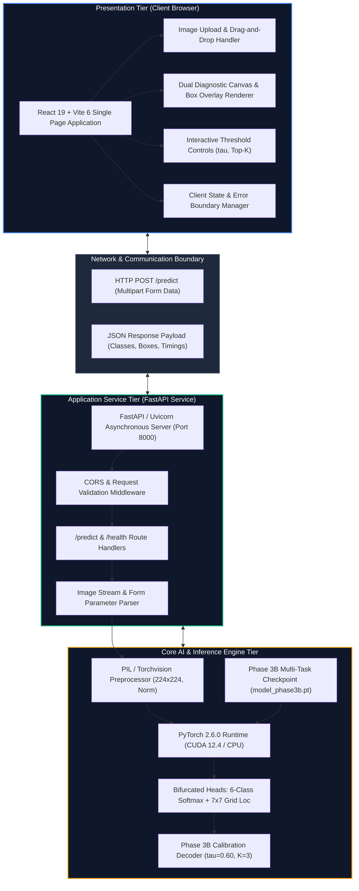
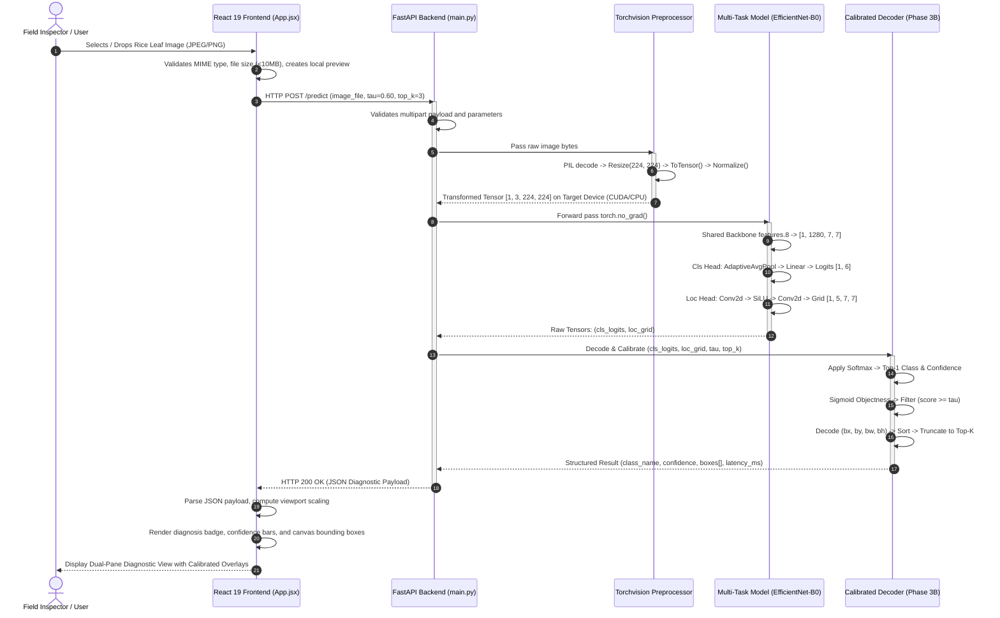
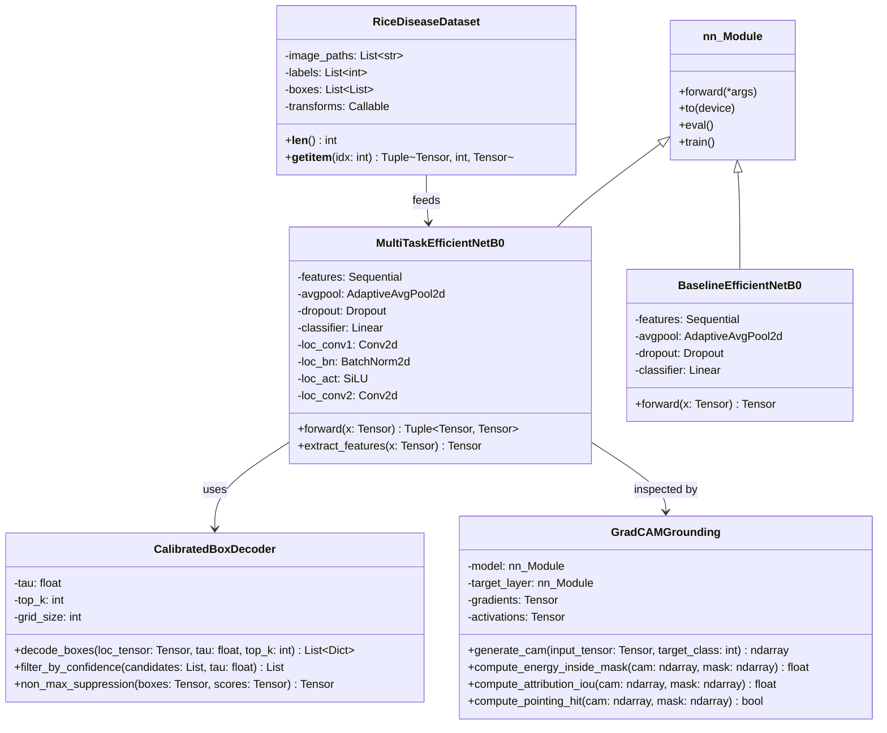

# Software and System Design: UML Diagrams

## Overview
This document presents the formal software engineering and system architecture diagrams for the **RiceGuard** platform. The diagrams model the actual, verified software components implemented across the repository, encompassing the client user interface (`app/frontend/`), asynchronous backend API server (`app/backend/main.py`), core neural inference engines (`src/models/`, `src/inference/`), and data management pipelines (`src/data/`).

---

## 1. System Architecture Diagram
The RiceGuard platform follows a modular, decoupled client-server architecture. The presentation tier communicates with the inference service via asynchronous RESTful HTTP endpoints.



---

## 2. Sequence Diagram: Diagnostic Inference Lifecycle
This sequence diagram models the chronological execution flow from the moment an agricultural user uploads a rice leaf image to the final rendering of the calibrated disease diagnosis.



---

## 3. Component Diagram: Software Subsystem Decomposition
The component diagram outlines the internal structural dependencies between the Python backend modules and the React frontend components.

```mermaid
flowchart LR
    subgraph Frontend_Components["React Frontend Subsystem"]
        AppUI["App.jsx<br/>(Root Container)"]
        DropzoneComp["ImageUploader.jsx<br/>(Drag-and-Drop Handler)"]
        DiagnosisCard["DiagnosisCard.jsx<br/>(Class & Confidence Display)"]
        CanvasOverlay["CanvasOverlay.jsx<br/>(Bounding Box Renderer)"]
        ConfigBar["ConfigControls.jsx<br/>(Threshold Sliders)"]

        AppUI --> DropzoneComp
        AppUI --> DiagnosisCard
        AppUI --> CanvasOverlay
        AppUI --> ConfigBar
    end

    subgraph Backend_Components["FastAPI Backend Subsystem"]
        APIRouter["main.py<br/>(FastAPI Application)"]
        InferService["predict_service.py<br/>(Inference Pipeline)"]
        ModelLoader["model_loader.py<br/>(Checkpoint Manager)"]
        
        APIRouter --> InferService
        InferService --> ModelLoader
    end

    subgraph Core_ML_Package["Core PyTorch Library (src/)"]
        NetArch["src.models.multitask_efficientnet<br/>(MultiTaskEfficientNetB0)"]
        Transforms["src.data.transforms<br/>(Preprocessing Pipelines)"]
        PostProc["src.inference.decoding<br/>(CalibratedBoxDecoder)"]
        XAIModule["src.xai.gradcam<br/>(GradCAMGrounding)"]

        ModelLoader --> NetArch
        InferService --> Transforms
        InferService --> PostProc
        NetArch -.-> XAIModule
    end

    Frontend_Components <==>|"REST / JSON via Axios / Fetch"| Backend_Components

    style Frontend_Components fill:#0f172a,stroke:#3b82f6,stroke-width:1px,color:#ffffff
    style Backend_Components fill:#0f172a,stroke:#10b981,stroke-width:1px,color:#ffffff
    style Core_ML_Package fill:#0f172a,stroke:#f59e0b,stroke-width:1px,color:#ffffff
```



---

## 4. Class Diagram: Core Domain and Architectural Entities
The class diagram details the object-oriented structure of the neural network architectures, data loaders, and calibrated decoders implemented in `src/`.



---

## 5. Activity Diagram: Image Ingestion and Dual-Output Diagnostic Flow
The activity diagram captures the decision branches and error-handling mechanisms active during client-side image processing and server-side model execution.

```mermaid
flowchart TD
    Start([User Initiates Diagnosis]) --> SelectImg[Select or Drop Image File]
    SelectImg --> ValClient{Valid Format & Size?}
    
    ValClient -- No --> ShowClientErr[Display Client Validation Alert] --> SelectImg
    ValClient -- Yes --> GenPreview[Render Local UI Thumbnail]
    
    GenPreview --> SendAPI[Send Multipart POST Request to /predict]
    SendAPI --> ValServer{Server Active & Payload Valid?}
    
    ValServer -- No --> ReturnHTTPError[Return HTTP 4xx/5xx Error]
    ReturnHTTPError --> ShowNetworkErr[Display User-Friendly Error Toast]
    
    ValServer -- Yes --> DecodeImg[Decode PIL Image & Convert RGB]
    DecodeImg --> ApplyTransform[Apply Resize 224x224 & Normalize]
    ApplyTransform --> RunInference[Execute Multi-Task Forward Pass on GPU/CPU]
    
    RunInference --> ExtractOutputs[Extract 6-Class Logits & 5x7x7 Grid Tensor]
    ExtractOutputs --> CompSoftmax[Compute Softmax Class Probabilities]
    ExtractOutputs --> DecodeGrid[Decode Grid Offsets to Normalized Coordinates]
    
    DecodeGrid --> FilterTau{Objectness >= tau?}
    FilterTau -- No --> DiscardCandidate[Discard Grid Cell]
    FilterTau -- Yes --> RetainCandidate[Retain Bounding Box Candidate]
    
    RetainCandidate --> RankSort[Sort Candidates Descending by Score]
    RankSort --> TruncateK[Truncate to Top-K Detections (K <= 3)]
    
    TruncateK --> PackJSON[Assemble JSON Response Payload]
    CompSoftmax --> PackJSON
    
    PackJSON --> Return200[Return HTTP 200 OK with Results]
    Return200 --> RenderUI[Render Disease Badge, Confidence Bars & Canvas Boxes]
    RenderUI --> End([Diagnosis Complete])

    style Start fill:#334155,color:#ffffff
    style End fill:#334155,color:#ffffff
    style ValClient fill:#1e293b,stroke:#f59e0b,color:#ffffff
    style ValServer fill:#1e293b,stroke:#f59e0b,color:#ffffff
    style FilterTau fill:#1e293b,stroke:#f59e0b,color:#ffffff
    style RunInference fill:#0f172a,stroke:#10b981,stroke-width:2px,color:#ffffff
    style RenderUI fill:#0f172a,stroke:#3b82f6,stroke-width:2px,color:#ffffff
```
