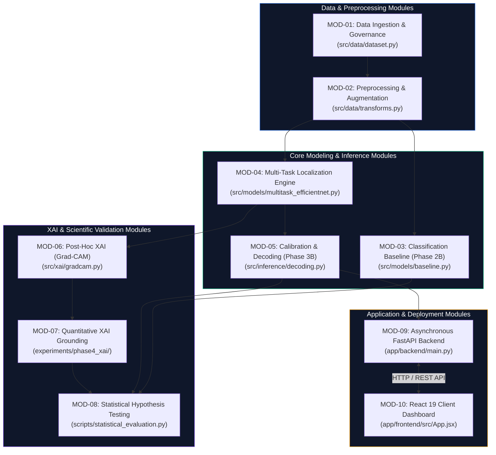

# Functional Modules Split-Up

## Overview
The **RiceGuard** project is structured into ten distinct functional modules spanning data governance, deep learning modeling, calibration, explainability benchmarking, statistical validation, and client-server application delivery. Every module corresponds directly to implemented source code, scripts, configurations, or application components in the repository.

---

## Detailed Specification of Functional Modules

| Module ID & Name | Purpose | Input Artifacts | Core Processing Operations | Output Artifacts | Dependent / Related Components |
| :--- | :--- | :--- | :--- | :--- | :--- |
| **MOD-01: Data Ingestion & Governance** | Enforces patient-level dataset partitioning and isolates out-of-distribution evaluation benchmarks. | Raw image directories (`data/`), label annotations, RiceSeg5932 mask directories. | Stratified 70/10/20 partitioning, verification of zero overlap, strict reservation of RiceSeg5932 masks for zero-shot XAI. | `splits/train.csv`, `splits/val.csv`, `splits/test.csv`, metadata logs. | `src/data/dataset.py`, `configs/dataset_config.yaml` |
| **MOD-02: Preprocessing & Augmentation** | Standardizes input resolution and applies stochastic augmentations during training. | Raw image files ($W \times H \times 3$). | Bilinear resizing to $224 \times 224$, ImageNet normalization, random flips, affine rotations, color jittering. | Transformed PyTorch tensors $[B, 3, 224, 224]$. | `src/data/transforms.py`, PyTorch `DataLoader` |
| **MOD-03: Classification Baseline (Phase 2B)** | Trains and benchmarks the upper-bound classification-only EfficientNet-B0 model. | Normalized training tensors $[B, 3, 224, 224]$, ground-truth class labels $y \in \{0..5\}$. | Forward propagation through `features.8`, adaptive pooling, dropout, linear projection, Cross-Entropy loss. | Baseline weights (`checkpoints/baseline_best.pt`), confusion matrix, test metrics. | `src/models/baseline.py`, `experiments/phase2b/` |
| **MOD-04: Multi-Task Localization Engine** | Bifurcates shared feature representations into classification logits and dense spatial grid tensors. | Image tensors $[B, 3, 224, 224]$, classification targets, bounding-box coordinates. | Forward pass yielding $\hat{\mathbf{y}} \in \mathbb{R}^6$ and $\mathbf{T}_{\text{loc}} \in \mathbb{R}^{5 \times 7 \times 7}$, multi-task loss computation ($\mathcal{L}_{\text{total}}$). | Multi-task checkpoint (`checkpoints/multitask_best.pt`), raw logit and grid tensors. | `src/models/multitask_efficientnet.py`, `experiments/phase3/` |
| **MOD-05: Calibration & Decoding (Phase 3B)** | Optimizes positive-weight loss ($w_{\text{pos}}=10.0$) and executes validation-only threshold and Top-$K$ decoding. | Raw spatial grid tensors $[B, 5, 7, 7]$, validation split ground-truth boxes. | Grid sweep over $\tau \in [0.1, 0.9]$ and $K \in [1, 10]$, sigmoid thresholding, coordinate decoding, score ranking. | Calibrated checkpoint (`checkpoints/phase3b_calibrated.pt`), frozen params ($\tau=0.60, K=3$), calibrated bounding boxes. | `src/inference/decoding.py`, `experiments/phase3b/` |
| **MOD-06: Post-Hoc XAI (Grad-CAM)** | Computes layer-targeted visual attribution heatmaps from the terminal convolutional feature map. | Query image tensors $[B, 3, 224, 224]$, target class index $c$, model feature layer (`features.8`). | Backward gradient flow $\partial \hat{y}_c / \partial \mathbf{A}^k$, global average pooling of gradients, ReLU-weighted linear combination, bilinear upsampling. | Attribution heatmaps $\mathbf{L} \in [0, 1]^{224 \times 224}$, visual overlay artifacts. | `src/xai/gradcam.py`, `src/xai/visualizer.py` |
| **MOD-07: Quantitative XAI Grounding** | Benchmarks attribution heatmaps against $N = 4,348$ independent biological lesion masks from RiceSeg5932. | Generated attribution heatmaps $\mathbf{L}$, binary ground-truth segmentation masks $\mathbf{M}$. | Computation of Energy-Inside-Mask, Otsu-thresholded Attribution IoU, Pointing Game hits, Healthy Border Attention, Deletion/Insertion curves. | `results/phase4_xai_grounding.csv`, EIM distributions, perturbation curves. | `experiments/phase4_xai/`, `src/xai/metrics.py` |
| **MOD-08: Statistical Hypothesis Testing** | Quantifies statistical significance of differences across experimental phases. | Paired prediction vectors, metric arrays across test samples ($N = 674$) and masks ($N = 4,348$). | McNemar's test for classification accuracy, paired two-tailed $t$-tests for EIM/Border attention, Wilcoxon signed-rank tests for Attribution IoU. | `results/statistical_report.json`, $p$-value matrices, significance tables. | `scripts/statistical_evaluation.py` |
| **MOD-09: Asynchronous FastAPI Backend** | Exposes high-performance RESTful API endpoints for client image ingestion and dual inference. | HTTP POST multipart request (`file`, optional `tau`, `top_k`). | Request validation, in-memory PIL transformation, PyTorch inference pass, calibrated box decoding, JSON assembly. | JSON response (`predicted_class`, `confidence`, `bounding_boxes`, `inference_latency_ms`). | `app/backend/main.py`, Uvicorn ASGI server |
| **MOD-10: React 19 Client Dashboard** | Provides an interactive, accessible user interface for agricultural practitioners and field evaluators. | User-selected image file (JPEG/PNG), user-adjusted threshold sliders. | Local thumbnail generation, asynchronous HTTP dispatch, dynamic SVG/Canvas bounding-box scaling, confidence bar rendering. | Interactive dual-pane diagnostic display, disease info badges, real-time bounding-box overlays. | `app/frontend/src/App.jsx`, Tailwind CSS |

---

## Module Dependencies and Execution Order
1. **Data Ingestion (MOD-01)** must execute prior to all training modules to guarantee stratified split consistency.
2. **Preprocessing (MOD-02)** feeds standardized tensors directly into **MOD-03**, **MOD-04**, **MOD-06**, and **MOD-09**.
3. **Multi-Task Modeling (MOD-04)** precedes **Calibration (MOD-05)** and **XAI (MOD-06)**.
4. **Calibration (MOD-05)** determines the frozen operational parameters ($\tau = 0.60, K = 3$) embedded directly into the **Backend API Service (MOD-09)**.
5. **Statistical Testing (MOD-08)** aggregates outputs from **MOD-03**, **MOD-05**, and **MOD-07** for formal scientific auditing.
6. **Frontend Dashboard (MOD-10)** communicates exclusively with **MOD-09** via HTTP REST interfaces.
