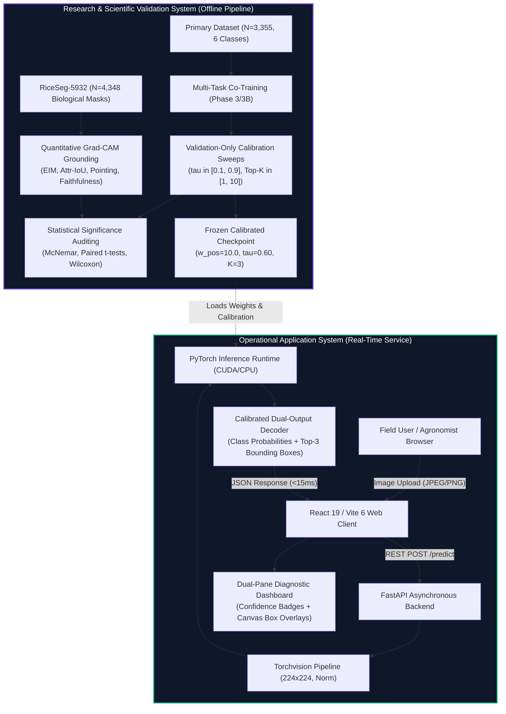

# Proposed System

## Architectural Overview
The **RiceGuard** system is architected along two synchronized functional tracks:
1. **The Research & Scientific Validation System**: An offline pipeline encompassing multi-task neural network co-training, loss refinement, validation-only calibration sweeps, quantitative Explainable AI (XAI) grounding against $N = 4,348$ biological masks, and statistical hypothesis testing.
2. **The Operational Application System**: An end-to-end, real-time client-server software system designed for interactive field diagnosis, featuring an asynchronous FastAPI backend and a responsive React 19 single-page application.

---

## 1. Research System Specification
The research system is dedicated to training, calibrating, and scientifically benchmarking the multi-task network:
- **Unified Backbone**: EfficientNet-B0 ($4.02\text{M}$ parameters, $15.61\text{ MB}$) extracting rich visual features from the terminal `features.8` layer ($1280 \times 7 \times 7$).
- **Multi-Task Objective**: Combines multi-class Cross-Entropy with objectness-weighted Binary Cross-Entropy ($w_{\text{pos}} = 10.0$) and Smooth L1 bounding box regression.
- **Validation-Only Calibration Protocol**: Evaluates grid combinations of $\tau \in [0.10, 0.90]$ and $K \in [1, 10]$ exclusively on the validation split ($N = 334$), freezing optimal parameters ($\tau = 0.60, K = 3$) prior to test evaluation.
- **Post-Hoc XAI Grounding Pipeline**: Generates Grad-CAM visual attribution maps and quantifies spatial alignment against $N = 4,348$ independent biological lesion masks from the RiceSeg5932 dataset.
- *Scientific Note*: The Grad-CAM extraction and pixel-level mask benchmarking pipeline operates as an offline scientific validation framework and is intentionally decoupled from the lightweight operational client to avoid unnecessary client-side latency.

---

## 2. Operational Application System Specification

### Input
- High-resolution or smartphone-acquired digital photograph of an affected rice leaf blade.
- Supported file formats: `JPEG`, `JPG`, `PNG`, `WEBP`.
- Maximum upload size: $10\text{ MB}$.

### Processing Pipeline
1. **Input Normalization**: In-memory decoding via PIL, conversion to RGB, bilinear resizing to $224 \times 224$ pixels, and normalization using ImageNet channel means and standard deviations.
2. **Model Inference**: Single forward pass through the multi-task EfficientNet-B0 network executing on CUDA GPU or CPU, generating 6-class classification logits $\hat{\mathbf{y}} \in \mathbb{R}^6$ and dense spatial localization grid $\mathbf{T}_{\text{loc}} \in \mathbb{R}^{5 \times 7 \times 7}$.
3. **Calibrated Decoding**:
   - Softmax transformation computes class posterior probabilities $P(\text{class} \mid \mathbf{x})$.
   - Grid objectness logits are converted to confidence scores via sigmoid activation $\sigma(l_{\text{obj}})$.
   - Grid cells with $\sigma(l_{\text{obj}}) < 0.60$ are filtered out.
   - Remaining candidate boxes are decoded to normalized coordinates $[b_x, b_y, b_w, b_h]$, sorted in descending order of confidence, and truncated to the Top-$3$ most salient detections.

### Output Presentation
- **Primary Diagnostic Classification**: Highest-probability disease category (or `Healthy`) with an associated percentage confidence score.
- **Complete Class Probability Distribution**: Bar charts showing posterior probabilities across all six supported classes.
- **Calibrated Lesion Bounding Boxes**: Dynamic SVG/Canvas overlays drawn directly over the uploaded leaf image, highlighting specific lesion clusters.
- **Diagnostic Metadata**: Total server-side model latency ($10.46\text{ ms}$ on CUDA) and calibrated threshold settings.

---

## Key Features
1. **Simultaneous Dual-Output Inference**: Delivers whole-image classification and localized spatial bounding boxes in a single lightweight forward pass without requiring multi-stage detector overhead.
2. **Calibrated False-Alarm Suppression**: Integrated Phase 3B calibration suppresses false-positive bounding boxes on healthy leaves by $49.0\%$ ($p < 10^{-6}$) and cuts visual clutter by $74.6\%$.
3. **Ultra-Low Latency & Compact Footprint**: Model parameter footprint of only $4.02\text{M}$ ($15.61\text{ MB}$) with inference latency under $11\text{ ms}$, ensuring suitability for edge devices and low-bandwidth rural deployments.
4. **Interactive Diagnostic Interface**: Modern React 19 interface allowing users to upload leaf photos, inspect disease predictions, and dynamically adjust confidence thresholds.

---

## System Advantages
- **Spatial Verification**: Farmers and agronomists can visually verify whether the model's diagnostic prediction aligns with genuine necrotic foliar lesions.
- **Edge Feasibility**: Operates with a fraction of the computational and memory demands of heavyweight detectors like Faster R-CNN ($>40\text{M}$ parameters) or Vision Transformers ($>85\text{M}$ parameters).
- **Scientifically Grounded**: Intermediate feature representations are regularized via multi-task learning, halving spurious border attention and improving biological lesion grounding.

---

## Verified System Limitations
To maintain strict scientific truth, the verified limitations of the RiceGuard system are documented as follows:
1. **Classification vs. Localization Trade-off**: Adding auxiliary localization slightly reduces nominal classification accuracy compared to the specialized baseline ($88.96\%$ vs $90.12\%$), although McNemar's test confirms this difference is not statistically significant ($p = 0.449$).
2. **Spatial Grid Resolution Constraints**: The $7 \times 7$ feature grid limits spatial localization precision for extremely tiny, punctate micro-lesions ($<10\text{ pixels}$) or heavily overlapping lesion clusters.
3. **Domain Shift and Uncontrolled Field Artifacts**: Diagnostic accuracy may degrade under severe out-of-distribution conditions, such as extreme underexposure, heavy motion blur, or dense multi-infection co-occurrences.
4. **Deployment Environment Scope**: Full end-to-end functionality is verified on local client-server execution (`http://localhost:5173` and `http://localhost:8000`). Production cloud hosting infrastructure (Docker, Vercel configuration) is prepared but has not been deployed to a public cloud domain.
