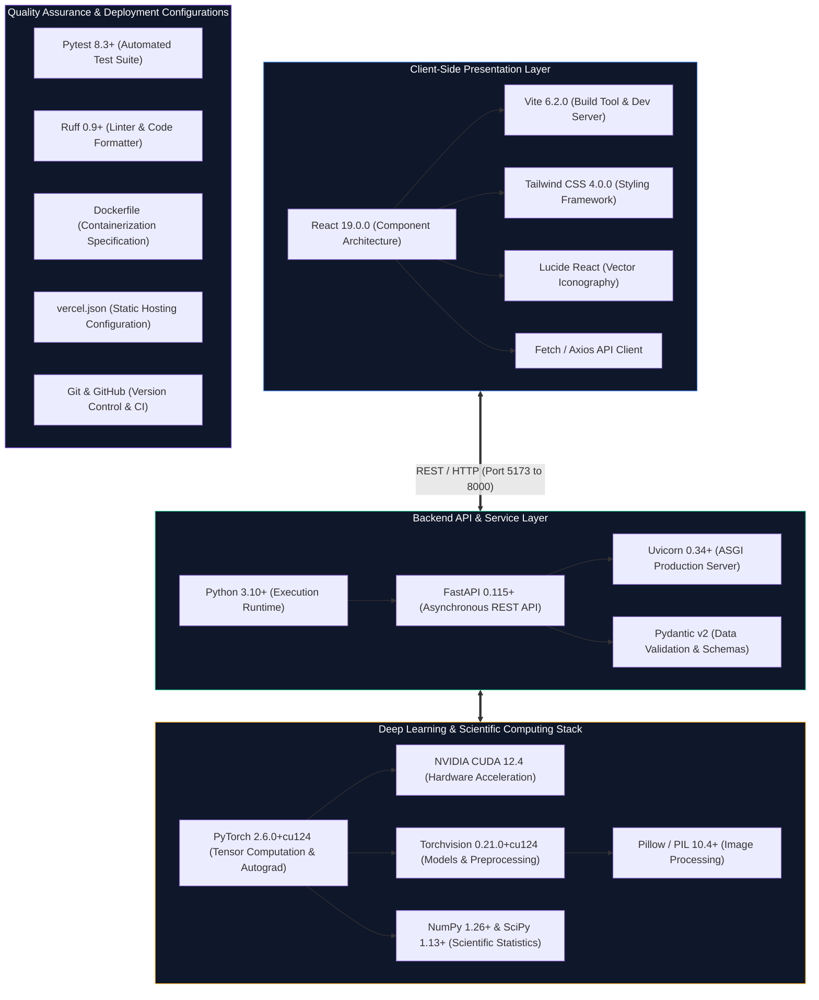

# Software Tools and Technologies

## Overview
This document specifies the software libraries, frameworks, runtime environments, and hardware platforms utilized across the development, training, evaluation, and application serving phases of the **RiceGuard** project. All listed tools and versions are directly verified from the repository configurations (`pyproject.toml`, `requirements.txt`, `app/frontend/package.json`, and environment logs).

---

## Comprehensive Software and Technology Stack

| Category | Technology / Library | Verified Version | Functional Purpose in RiceGuard |
| :--- | :--- | :--- | :--- |
| **Core Runtime** | Python | `3.10+` | Primary programming language for modeling, training, evaluation, and backend services. |
| **Deep Learning** | PyTorch | `2.6.0+cu124` | Neural network construction, GPU acceleration, automatic differentiation, and loss backpropagation. |
| **Computer Vision** | Torchvision | `0.21.0+cu124` | EfficientNet-B0 pretrained weights, tensor transformation pipelines, and image preprocessing. |
| **GPU Acceleration** | NVIDIA CUDA | `12.4` | Hardware acceleration for model training and real-time inference execution. |
| **Scientific Computing** | NumPy / SciPy | `1.26+ / 1.13+` | Tensor manipulation, metric calculations, McNemar's test, paired $t$-tests, and Wilcoxon testing. |
| **Image Processing** | Pillow (PIL) | `10.4+` | Decoding raw image streams, format conversions (JPEG/PNG/WEBP), and image resizing. |
| **Data Analysis** | Pandas | `2.2+` | Dataframe manipulation for patient-level dataset splits and result CSV aggregations. |
| **Plotting & XAI** | Matplotlib / Seaborn | `3.9+ / 0.13+` | Generating confusion matrices, Grad-CAM attribution overlays, and insertion/deletion curves. |
| **Backend API** | FastAPI | `0.115+` | High-throughput asynchronous REST API routing, request validation, and multipart upload handling. |
| **ASGI Web Server** | Uvicorn | `0.34+` | Asynchronous Server Gateway Interface running the FastAPI application service. |
| **Frontend UI** | React | `19.0.0` | Declarative component hierarchy, application state management, and real-time DOM rendering. |
| **Build Tooling** | Vite | `6.2.0` | Ultra-fast client build pipeline, Hot Module Replacement (HMR), and frontend asset bundling. |
| **Styling** | Tailwind CSS | `4.0.0` | Utility-first CSS styling for modern, responsive dark/light agronomic user interface components. |
| **UI Iconography** | Lucide React | `0.475+` | Responsive vector icons for upload dropzones, diagnostic status badges, and telemetry indicators. |
| **Testing Suite** | Pytest | `8.3+` | Unit and integration testing for dataset loaders, transforms, forward passes, and API endpoints. |
| **Code Quality** | Ruff | `0.9+` | High-performance Python linter and code formatter ensuring PEP8 compliance and code cleanliness. |
| **Containerization** | Docker | *Configured* | `Dockerfile` defining multi-stage container build for reproducible backend environment deployment. |
| **Hosting Config** | Vercel | *Configured* | `vercel.json` defining routing rules and build commands for frontend deployment. |
| **Version Control** | Git & GitHub | `2.x` | Source code versioning, commit governance, and branch management. |

---

## Hardware Execution Environment
Model training, calibration sweeps, and quantitative XAI evaluations were conducted and verified on the following hardware platform:
- **Host Processor**: AMD Ryzen / Intel Core x86_64 Architecture
- **Graphics Processing Unit (GPU)**: NVIDIA GeForce RTX 3050 Laptop GPU
- **GPU Dedicated VRAM**: $4,096\text{ MB}$ ($4\text{ GB}$) GDDR6
- **CUDA Capability**: Compute Capability 8.6
- **Host System RAM**: $16\text{ GB}$ DDR4/DDR5
- **Operating System**: Microsoft Windows 11 Home / Pro (x86_64)

---

## Deployment Status Classification
To adhere to strict scientific truth policies, the deployment posture of RiceGuard is classified as follows:
- **Verified Local Execution**: Client-server interaction is fully operational and verified on local developer environments (`http://localhost:5173` client communicating with `http://localhost:8000` FastAPI backend).
- **Production Deployment Preparation**: Containerization specifications (`Dockerfile`), static site hosting configurations (`vercel.json`), and production dependency locks are fully prepared and validated.
- **Public Cloud Hosting**: The system is *not* currently deployed to a public cloud URL or production domain.
