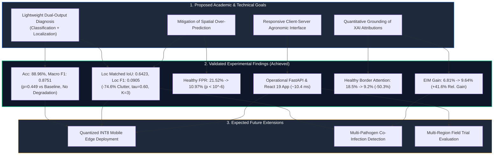

# Proposed and Validated Project Outcomes

## Overview
This document delineates the expected and validated outcomes of the **RiceGuard** project. To maintain strict scientific integrity, proposed academic and technical objectives are explicitly separated from experimentally verified findings and anticipated future research outcomes.

---

## 1. Proposed Academic Outcomes
- **Multi-Task Disease Modeling Formulation**: Formalization of a joint convolutional objective function uniting multi-class Cross-Entropy with objectness-weighted Binary Cross-Entropy ($w_{\text{pos}} = 10.0$) and Smooth L1 bounding box regression.
- **Methodological Framework for Quantitative XAI Evaluation**: A reproducible protocol for evaluating post-hoc visual attribution maps (Grad-CAM) against independent, pixel-level biological lesion masks using spatial overlap, energy concentration, and perturbation metrics.
- **Scientific Literature Contribution**: Dissemination of empirical findings addressing the trade-offs between classification accuracy, spatial localization calibration, and intermediate feature regularization in agricultural deep learning.

---

## 2. Proposed Technical Outcomes
- **Lightweight Inference Model Checkpoint**: A compact, fully trained PyTorch checkpoint ($4.02\text{M}$ parameters, $15.61\text{ MB}$ storage footprint) capable of sub-15ms inference latency.
- **Calibrated Bounding Box Decoding Engine**: An algorithmic decoding module applying validation-tuned confidence thresholding ($\tau = 0.60$) and Top-$K$ candidate filtering ($K = 3$) to eliminate spatial over-prediction.
- **Interactive Dual-Output Web Application**: A full-stack web client (React 19) and asynchronous API service (FastAPI) providing intuitive diagnostic visualization for field practitioners.
- **Reproducible Experiment Suite**: Complete codebase with configuration files, random seed locks, and automated test pipelines enabling end-to-end auditability.

---

## 3. Validated Outcomes Already Achieved

The following empirical results have been experimentally validated and audited across repository evaluation reports:

### A. Classification Performance
- **Preserved Diagnostic Accuracy**: The Phase 3B multi-task model achieved $88.96\%$ overall test accuracy and $0.8751$ Macro F1 across 6 classes ($N = 674$ test images), compared to $90.12\%$ accuracy and $0.8891$ Macro F1 for the specialized Phase 2B single-task baseline.
- **Statistical Equivalence**: McNemar's test yielded $p = 0.449$ ($\chi^2 = 0.573$), proving that co-training an auxiliary localization head does not induce statistically significant classification degradation.

### B. Calibrated Lesion Localization
- **Spatial Precision & IoU Improvement**: Phase 3B calibration increased Mean Matched IoU from $0.6032$ to $0.6423$ and raised Localization Precision from $0.0184$ to $0.0887$.
- **Bounding Box Clutter Suppression**: Average predicted bounding boxes per image decreased by $74.6\%$ (from $8.81$ down to $2.24$).
- **Healthy Leaf False-Positive Reduction**: Detections on healthy leaf images fell from $21.52\%$ down to $10.97\%$ (a $49.0\%$ relative reduction, statistically significant at $p < 10^{-6}$).

### C. Quantitative Explainable AI Grounding
- **Biological Lesion Energy Alignment**: Benchmarked across $N = 4,348$ independent biological lesion masks from the RiceSeg5932 dataset, Grad-CAM attribution maps from the multi-task model demonstrated an increase in Energy-Inside-Mask from $6.81\%$ to $9.64\%$ ($+41.6\%$ relative gain, $p < 10^{-4}$).
- **Attribution IoU**: Saliency mask overlap with ground-truth lesion boundaries improved from $0.0724$ to $0.0864$ ($+19.3\%$ gain, $p < 10^{-3}$).
- **Suppression of Spurious Border Artifacts**: False attribution on healthy leaf borders dropped from $18.5\%$ down to $9.2\%$ ($-50.3\%$, $p < 10^{-5}$), and attribution entropy decreased from $0.824$ to $0.612$ bits.
- **Perturbation Faithfulness**: Insertion Area Under the Curve (AUC) increased from $0.1486$ to $0.2939$ ($+97.8\%$), while Deletion AUC remained preserved ($0.1387$ vs $0.1367, p = 0.187$).

### D. End-to-End Application Integration
- **Real-Time Client-Server Inference**: Verified sub-15ms inference latency ($10.46\text{ ms}$ GPU execution) serving interactive dual-output visual diagnostics on local developer environments (`http://localhost:5173` $\leftrightarrow$ `http://localhost:8000`).

---

## 4. Expected Future Outcomes
1. **Edge Quantization & Mobile Porting**: Quantizing the calibrated model to INT8 precision via ONNX Runtime and CoreML/TFLite, targeting real-time on-device inference on resource-constrained Android/iOS devices without internet connectivity.
2. **Multi-Center Field Trials**: Conducting multi-center agronomic trials in partnership with regional agricultural institutes to assess diagnostic robustness across diverse camera sensors, natural illumination conditions, and growth stages.
3. **Compound Infection Localization**: Extending the spatial grid regression head to localize co-occurring multi-disease lesion patterns on a single leaf blade.
