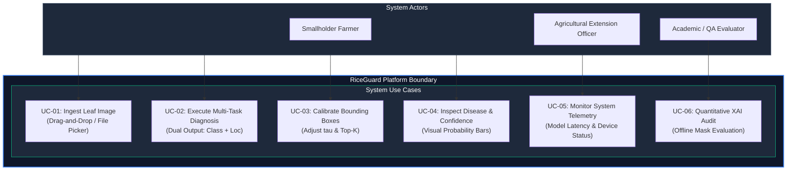

# Software Requirements Specification (SRS)

## 1. Introduction

### 1.1 Purpose
This Software Requirements Specification (SRS) document provides a formal, comprehensive description of the functional, non-functional, interface, and performance requirements for the **RiceGuard** software platform (*Multi-Task Deep Learning for Rice Leaf Disease Classification and Calibrated Lesion Localization with Explainable AI Grounding*).

### 1.2 Scope
RiceGuard delivers an integrated, real-time diagnostic platform for identifying rice foliar phytopathologies. The platform ingests digital images of rice leaves, executes a multi-task deep neural network on an asynchronous backend, and returns 6-class disease probabilities along with calibrated spatial bounding boxes marking lesion locations. The platform is designed for agricultural field officers, agronomists, and smallholder farmers.

### 1.3 Definitions, Acronyms, and Abbreviations
- **API**: Application Programming Interface
- **AUC**: Area Under the Curve
- **BCE**: Binary Cross-Entropy
- **CNN**: Convolutional Neural Network
- **EIM**: Energy-Inside-Mask
- **FPR**: False-Positive Rate
- **Grad-CAM**: Gradient-weighted Class Activation Mapping
- **IoU**: Intersection over Union
- **REST**: Representational State Transfer
- **Top-$K$**: Retention of the top $K$ highest-scoring bounding-box candidate predictions
- **XAI**: Explainable Artificial Intelligence

---

## 2. Overall Description

### 2.1 Product Perspective
RiceGuard is a modular, decoupled client-server application. The frontend is a Single-Page Application (SPA) built with React 19 and Vite 6, styled using Tailwind CSS. The backend is an asynchronous REST API built with FastAPI and Uvicorn running a PyTorch 2.6.0 neural inference runtime.



### 2.2 Product Functions
- Ingest JPEG, PNG, or WEBP leaf images up to $10\text{ MB}$.
- Classify foliar pathology into 6 categories (Bacterial Blight, Blast, Brown Spot, Tungro, Leaf Scald, Healthy).
- Spatially localize necrotic lesion clusters using calibrated bounding boxes.
- Dynamically filter bounding boxes using interactive confidence threshold ($\tau$) and Top-$K$ controls.
- Display server-side inference latency and system telemetry.

### 2.3 User Characteristics
- **Agricultural Field Practitioners**: Non-technical users requiring clear visual indicators and fast diagnostic feedback.
- **Agronomists and Researchers**: Technical users who verify lesion boundaries against visual symptoms.
- **System Developers and Evaluators**: Technical evaluators reviewing API contracts, latency, and model metrics.

### 2.4 Operating Environment
- **Client**: Any modern web browser (Google Chrome 100+, Mozilla Firefox 100+, Safari 15+, Microsoft Edge).
- **Backend Server**: Python 3.10+ on Linux or Windows x86_64 with NVIDIA CUDA 12.4 GPU acceleration (or CPU fallback).

### 2.5 Design Constraints
- Image processing must standardize inputs to $224 \times 224$ pixels without severe aspect-ratio distortion.
- Total model footprint must remain under $20\text{ MB}$ ($4.02\text{M}$ parameters) to allow edge execution.
- Operational inference must complete in under $100\text{ ms}$ round-trip time on local networks.

---

## 3. Functional Requirements

| Req ID | Requirement Title | Description & Acceptance Specification | Status |
| :--- | :--- | :--- | :---: |
| **FR-01** | Image File Ingestion | The system shall accept image uploads via file selection or drag-and-drop supporting JPEG, PNG, and WEBP formats up to $10\text{ MB}$. | Implemented |
| **FR-02** | Client Validation & Preview | The frontend shall validate MIME types and file sizes before network dispatch, rendering an immediate local thumbnail preview. | Implemented |
| **FR-03** | Asynchronous API Dispatch | The frontend shall dispatch multipart HTTP POST requests to `/predict` containing image bytes and optional decoding parameters ($\tau, K$). | Implemented |
| **FR-04** | Input Normalization | The backend shall decode image streams into RGB format, resize to $224 \times 224$, and apply ImageNet channel normalization. | Implemented |
| **FR-05** | Multi-Task Forward Inference | The PyTorch runtime shall execute a single forward pass over the shared EfficientNet-B0 backbone, generating class logits and a $5 \times 7 \times 7$ grid tensor. | Implemented |
| **FR-06** | 6-Class Probability Calculation | The backend shall compute softmax posterior probabilities across all 6 classes and return top-1 prediction with full distribution. | Implemented |
| **FR-07** | Calibrated Box Decoding | The backend shall decode grid offsets, filter boxes where $\sigma(l_{\text{obj}}) < \tau$ (default $\tau = 0.60$), and truncate results to Top-$K$ (default $K = 3$). | Implemented |
| **FR-08** | Dual-Pane Result Rendering | The frontend shall render a dual-pane interface displaying disease class, confidence badge, probability breakdown, and SVG canvas box overlays. | Implemented |
| **FR-09** | Interactive Threshold Sliders | The frontend shall provide interactive UI controls allowing dynamic re-filtering of bounding boxes across $\tau \in [0.1, 0.9]$ and $K \in [1, 10]$. | Implemented |
| **FR-10** | System Telemetry Display | The backend shall measure neural execution time and return exact model latency in milliseconds, rendered on the frontend. | Implemented |
| **FR-11** | Health Check Endpoint | The backend shall expose a `/health` REST endpoint returning server status, GPU device name, and model load state. | Implemented |
| **FR-12** | Offline XAI Grounding Pipeline | The system shall provide an offline script evaluating Grad-CAM attributions against $N=4,348$ RiceSeg5932 segmentation masks. | Implemented |
| **FR-13** | Edge Quantization Pipeline | The system shall export PyTorch checkpoints to INT8 ONNX and TFLite formats for native mobile deployment. | *Proposed* |
| **FR-14** | Multi-Infection Localization | The system shall support simultaneous spatial labeling of distinct co-occurring pathogens on a single leaf. | *Proposed* |

---

## 4. Non-Functional Requirements

### 4.1 Performance & Latency
- **NFR-P01**: Model forward inference latency on CUDA hardware shall not exceed $20\text{ ms}$ per image (verified: $10.46\text{ ms}$).
- **NFR-P02**: End-to-end API response time on local networks shall remain under $50\text{ ms}$.

### 4.2 Accuracy & False-Positive Suppression
- **NFR-A01**: Disease classification Macro F1 score on the held-out test split ($N = 674$) shall exceed $0.85$ (verified: $0.8751$).
- **NFR-A02**: Healthy leaf false-positive detection rate after calibration shall not exceed $15\%$ (verified: $10.97\%$).

### 4.3 Reliability & Availability
- **NFR-R01**: The backend server shall gracefully handle malformed, corrupted, or non-image payloads, returning structured HTTP 400/422 JSON errors without process crashes.

### 4.4 Portability & Maintainability
- **NFR-M01**: The backend codebase shall be packaged with a standardized `Dockerfile` and pass all automated tests (`pytest`) and linting (`ruff`).
- **NFR-M02**: The frontend shall be fully responsive across desktop ($1920 \times 1080$), laptop ($1366 \times 768$), and mobile viewport resolutions.

---

## 5. External Interface Specifications

### 5.1 REST API Schema: `/predict` Endpoint

#### Request Specification
- **Method**: `POST`
- **Path**: `/predict`
- **Content-Type**: `multipart/form-data`
- **Parameters**:
  - `file` (*required*, binary): Image file bytes.
  - `confidence_threshold` (*optional*, float, default: `0.60`): Objectness cutoff $\tau$.
  - `top_k` (*optional*, integer, default: `3`): Maximum detections to return.

#### Response Specification (HTTP 200 OK)
```json
{
  "predicted_class": "Rice Blast",
  "confidence": 0.9412,
  "class_probabilities": {
    "Bacterial Blight": 0.0120,
    "Blast": 0.9412,
    "Brown Spot": 0.0210,
    "Tungro": 0.0051,
    "Leaf Scald": 0.0142,
    "Healthy": 0.0065
  },
  "bounding_boxes": [
    {
      "box": [0.245, 0.312, 0.180, 0.220],
      "confidence": 0.8841
    },
    {
      "box": [0.550, 0.610, 0.120, 0.150],
      "confidence": 0.7320
    }
  ],
  "model_latency_ms": 10.46,
  "device": "cuda:0",
  "status": "success"
}
```

---

## 6. Acceptance Criteria

| Criteria ID | Verification Method | Pass Condition |
| :--- | :--- | :--- |
| **AC-01** | Automated Unit Tests (`pytest`) | $100\%$ pass rate across data loader, transform, and model forward pass tests. |
| **AC-02** | Classification Benchmark | Held-out test accuracy $\ge 88.0\%$ and Macro F1 $\ge 0.85$. |
| **AC-03** | Calibration Verification | Healthy leaf false-positive rate $\le 12.0\%$ under $\tau = 0.60, K = 3$. |
| **AC-04** | Inference Latency | GPU inference latency $\le 15.0\text{ ms}$ on test batches. |
| **AC-05** | UI Interaction Flow | Successful image upload, inference trigger, and dual-pane rendering on `http://localhost:5173`. |

---

## 7. Assumptions and Dependencies
- Images are assumed to contain foliar tissue captured under reasonable illumination without severe motion blur.
- GPU acceleration requires an NVIDIA GPU with compatible CUDA 12.4 drivers; CPU execution is supported as a fallback.
- Client browsers are assumed to have JavaScript enabled.
